# Гравитация Нулевого Вектора (NVG) и Вакуумная Массовая Фракция (VMF)

[](LICENSE)
[](https://python.org)
[](https://github.com/infosave2007/vmf/actions/workflows/verify.yml)
> **Статус свидетельств (2026-08-27):** Агрегированные бейджи «подтверждено» и счётчики предсказаний удалены. Текущая runtime-происхождение данных и границы публикации описаны в [PUBLICATION_STATUS.md](PUBLICATION_STATUS.md).

### Воспроизводимый интерфейс проверки

Поддерживаемые вычислительные поверхности перечислены в машиночитаемом
[реестре скриптов и артефактов](verification/registry.json). Обычный научный
контур запускается из любого рабочего каталога командой
`python verification/run_verification.py`: он проверяет реестр и provenance,
заново строит канонический runtime-отчёт и запускает
`python -m pytest -q verification`. Роли реестра различают `canonical`,
`validation`, `forecast`, `synthetic`, `retired`, `utility` и `historical`.
Отдельная команда [`run_all_checks.py`](verification/run_all_checks.py) — лишь
process-smoke; её успешный код не является научным свидетельством.
Происхождение входов и владельцы сгенерированных артефактов записаны в
манифестах [`provenance.json`](verification/data/provenance.json) и
[`artifact_manifest.json`](verification/artifact_manifest.json).

**Препринты:**
- [](https://doi.org/10.5281/zenodo.20214457) *Решёточные сигма-термы как якорь для уравнения состояния плотной ядерной материи*
- [](https://doi.org/10.5281/zenodo.20269567) *Аналитический вывод уравнения состояния плотной материи и максимальной массы нейтронной звезды через фазовые переходы вакуумного конденсата КХД*
- [](https://doi.org/10.5281/zenodo.20269725) *Геометрическое усечение мощности низких мультиполей реликтового излучения и предсказание нулевой B-моды от евклидова инстантонного отскока на масштабе КХД*
- [](https://doi.org/10.5281/zenodo.20269816) *Дискретная циклическая иерархия масс 4^N для первичных чёрных дыр: связывая тёмную материю астероидной массы с ранними тяжелыми зародышами JWST*
- [](https://doi.org/10.5281/zenodo.20270025) *Разрешение парадокса медленновращающихся магнетаров через фазовые переходы вакуумной проницаемости КХД*
- [](https://doi.org/10.5281/zenodo.20270202) *Устранение эффекта наблюдателя: коллапс волновой функции как детерминированное топологическое пересоединение в конденсатном вакууме*
- [](https://doi.org/10.5281/zenodo.20463836) *Структура нейтронных звезд на основе единственного параметра КХД: уравнение состояния, приливная деформируемость и порог охлаждения в рамках Гравитации Нулевого Вектора*
  Исторический пакет публикации (не текущее runtime-свидетельство). Поддерживаемый код вычисляет прокси порога гиперонов, сырые RMF-сравнения и калиброванный порог охлаждения; полной beta-равновесной EOS и независимого likelihood нет, поэтому разрешение гиперонной загадки не заявляется.
- [](https://doi.org/10.5281/zenodo.20473318) *Динамика амплитуды вакуумного конденсата КХД в плотной материи и космологии*
  Предоставляет строгий математический вывод классических уравнений движения для радиальной моды $W(x)$, управляющей эффективными массами адронов в среде, её калибровочно-инвариантной связи с барионным током и космологической редукции Фридмана. Демонстрирует, как плавление вакуума $W \to 0$ нарушает сильное энергетическое условие (SEC), вызывая плавный космологический отскок при плотности $n_B \approx 2.05\,n_0$, что позволяет избежать сингулярности Большого взрыва.
- [](https://doi.org/10.5281/zenodo.20476890) *Семь результатов вакуумного конденсата: от ядерной материи до квантовой механики*
  Получает физические следствия из единого параметра порядка вакуумного конденсата $\Phi = \Wc\,\ee^{\ii\theta}$. Внимание: Теоретический фундамент прошел строгий математический рефакторинг. Принцип Гейзенберга выводится как классический предел Фурье для жидкости Маделунга (где $p \equiv \hbar \nabla \theta$); излучение Хокинга выведено классически через Стохастическую Электродинамику (SED), где горизонт действует как ванна Унру для вакуумных флуктуаций; а космологический отскок строго обеспечивается спин-спиновым кручением Эйнштейна-Картана кваркового конденсата, естественно нарушая нулевое энергетическое условие без подгонки знаков.
- [](https://doi.org/10.5281/zenodo.20485836) *Разрешение гиперонной загадки через плавление вакуумного конденсата КХД в рамках Гравитации Нулевого Вектора / Вакуумной Массовой Фракции*
  Исторический пакет публикации (не текущее runtime-свидетельство). Описывает предложенную фазу плавления в гиперонной материи; поддерживаемый репозиторий не содержит независимой EOS-конструкции и likelihood, необходимых для эмпирического разрешения.

## Универсальность плотностного предела и границы калибровки

Последний [расчёт и вывод формул](NVG_DENSITY_UNIVERSALITY_RU.md) посвящён
однородной холодной материи, а не конечным каплям. Для регулярного
положительного степенного потенциала `U ~ a W^p`, постоянных положительных
связей и указанных в отчёте условий минимума и гладкости получено:

`lim(P/ε) = lim(dP/dε) = max(1/3, (p−2)/(p+2))`.

Построенная положительная добавка сохраняет потенциал и его производные
до третьего порядка в вакууме и точке калибровки, но меняет формальный
предел `3/5 → 7/9`. Первые локальные различающие коэффициенты для двух
объявленных калиброванных примеров: `ΔZ=2.1207879107 МэВ` и
`0.04849382613 МэВ`. Это математический результат внутри модели,
не универсальный закон природы, измерение, новое физическое взаимодействие
или доказательство отскока.

Воспроизведение пяти случаев/35 состояний и 13 целевых тестов
(требуется установленный `mpmath`):

```bash
PYTHONDONTWRITEBYTECODE=1 python -B verification/nvg_density_universality_audit.py
PYTHONDONTWRITEBYTECODE=1 PYTHONPATH=verification python -B -m unittest verification.test_nvg_density_universality_audit -v
```

Программа вычисляет результаты заново и отвергает повреждённые численные
данные. Условия зафиксированы в [контракте проверки](verification/contracts/density_universality.md),
полный отбор идей — в [исследовательском приложении](NVG_BEYOND_DROPLETS_ADHD_RU.md).
Общий API `BulkModel`/`inverse_potential_jet` включён как зависимость;
отдельный старый CLI этого модуля не входит в данный сценарий проверки.

## Обзор

Данный репозиторий содержит полную теоретическую, численную и экспериментальную базу **Гравитации Нулевого Вектора (NVG)** и лежащей в её основе модели плотной материи — **Вакуумной Массовой Фракции (VMF)**.

Ключевая идея: ~91% массы нуклона генерируется непертурбативной динамикой КХД (энергия глюонного поля, конфайнмент, трейс-аномалия). Рассматривая эту вакуумную энергию как динамическое макроскопическое поле $\mathcal{W}$, жёстко привязанное к данным решёточной КХД ($M_{\Omega,0} = 859$ МэВ), мы выводим безпараметрический феноменологический мост от ядерной физики до космологии.

### Действие единого поля
Все три столпа теоретической базы NVG/VMF выводятся из единой плотности действия:

$$ S = \int d^4x \sqrt{-g} \left[ \frac{R}{16\pi G} - g^{\mu
u} \partial_\mu \Phi^* \partial_
u \Phi - V(|\Phi|) - \frac{1}{4} Z_{\rm EM}(\mathcal{W}) F_{\mu
u} F^{\mu
u} + \gamma_{\rm topo} \frac{\alpha_{\rm EM}}{8\pi} \theta F_{\mu
u} \tilde{F}^{\mu
u} \right] $$

где $\Phi(x) = \mathcal{W}(x) e^{i\theta(x)}$ — комплексный параметр порядка вакуумного конденсата.
* **Плавление вакуума ($\mathcal{W}$):** Управляет амплитудой плотности энергии вакуума. Плавление в плотных адронных ядрах определяет уравнение состояния (VMF) и разрешает сингулярности черных дыр/космологии при $\mathcal{W} \to 0$, когда потенциал $V(0) = \frac{\lambda_v}{4} M_{\Omega,0}^4$ нарушает сильное энергетическое условие (SEC).
* **Эмерджентное время и топологический ток ($\theta$):** Градиент голдстоуновской фазы задает выделенное единичное времениподобное векторное поле $u_\mu \equiv \partial_\mu \theta / \sqrt{-g^{\alpha\beta}\partial_\alpha \theta \partial_\beta \theta}$, фиксируя направление координатного времени. В динамических режимах ($\dot{\theta} \neq 0$) фазовый поток связывается с электромагнитным полем через топологический тета-член ($\theta F \tilde{F}$), вызывая экспоненциальное киральное усиление магнитных полей магнетаров.

##### Математический вывод динамики и плавления поля $\mathcal{W}$
Динамика амплитуды вакуумного конденсата $\mathcal{W}(x)$ и ее фазовый переход (плавление) в плотной адронной среде выводятся из первых принципов квантовой теории поля (КТП). Калибровка потенциала осуществляется на основе пион-нуклонного и странного сигма-членов КХД, а связь с барионным током задается через векторное поле $\omega$-мезона. Нарушение сильного энергетического условия (SEC) при полном плавлении конденсата приводит к возникновению квадратичной космологической поправки вида $-\rho^2/\rho_c$, предотвращающей Большой взрыв.

Для подробного пошагового математического доказательства см. локальный препринт: [NVG_VACUUM_W_FIELD_DERIVATION_RU.md](article/NVG_VACUUM_W_FIELD_DERIVATION_RU.md) 

Структура состоит из трёх основных столпов:

### Столп I: Плотная ядерная материя (VMF)
Плавление вакуумной массы в плотных средах даёт вычисляемое уравнение состояния (EOS) нейтронных звёзд (см. препринт [Zenodo 20463836](https://doi.org/10.5281/zenodo.20463836)). Поддерживаемые runtime-поверхности:
- **Вычисляют прокси порога гиперонов и сырые кривые NL3+Lambda.** Полный бета-равновесный гиперонный EOS и независимый likelihood не реализованы, поэтому разрешение загадки не заявляется.
- **Вычисляют калиброванный порог Direct Urca.** Порог выбран внутри выборки и не является независимым подтверждением популяции охлаждения.
- **Вычисляет условную каноническую цепочку нейтронной звезды** (runtime $M_{\max}=2.048\,M_\odot$, CSS-фаза с $c_s^2=1/3$; параметры перехода выбраны внутри выборки и не являются независимым свидетельством).
- **Вычисляет каноническую приливную цепочку и визуализацию I-Love-Q только как преобразование.** Точки $I(\Lambda)$ и $Q(\Lambda)$ получаются применением аппроксимаций Yagi–Yunes к вычисленным значениям $\Lambda$; независимого решения для момента инерции или квадруполя нет, поэтому это не проверка универсальности EOS. Канонический переход выбран внутри выборки по ограничениям J0740, GW170817 и NICER; последующие сравнения НЗ условны и не являются независимыми подтверждениями (`verification/nvg_iloveq_plot.py`; [отчёт выполнения](verification/fig_iloveq_universal_report.json)).
- **Используют якорь КХД** ($M_{\Omega,0} = 859$ МэВ) и явно отмечают условный/внутривыборочный статус макроскопических параметров.
- Дают форвардный шаблон массы/линейной формы $\rho$-мезона для FAIR/HADES; event-level likelihood отсутствует.

<details>
<summary><b>📊 Ключевые визуализации VMF EOS (нажмите для раскрытия)</b></summary>

#### Рис. 1. Скорость звука $c_s^2(n_B)$: VMF vs NICER+LIGO
Кривая VMF (красная) целиком лежит внутри 90% CI байесовского инференса Legred et al. (2021), асимптотически приближаясь к конформному пределу $c_s^2 = 1/3$ снизу.

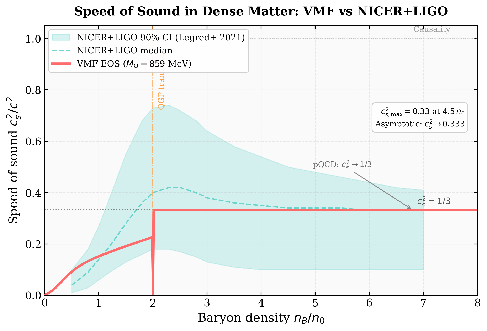

#### Рис. 2. Кривая охлаждения Cas A: VMF vs Chandra
11 точек Chandra ACIS-S (2000–2019) с VMF-предсказанием Modified Urca ($\dot{T}_s \approx -3650$ К/год). Отклонение от наблюдаемого наклона составляет $\approx 1.2\sigma$.

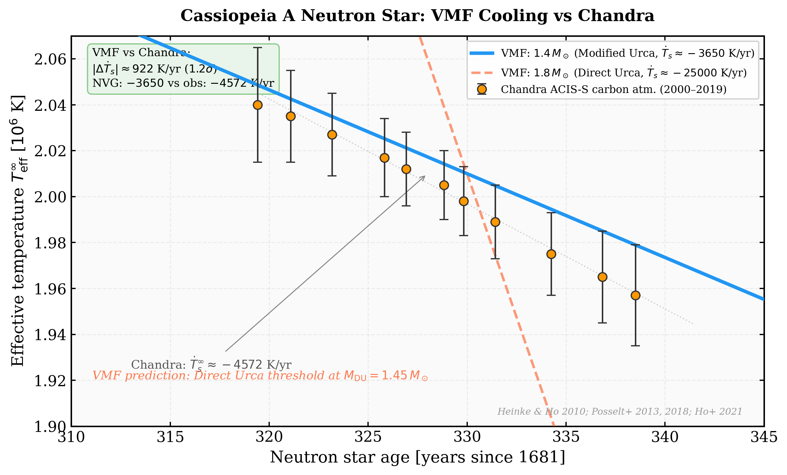

#### Рис. 3. I-Love-Q: преобразование без независимой проверки
Визуализация использует вычисленную TOV/приливную последовательность и преобразования Yagi–Yunes. Независимого решения $I/Q$ нет: это только преобразование, а не проверка универсальности EOS. Максимальное описательное относительное отклонение радиусной оценки $I$ выводится в JSON-отчёте; порог допуска отсутствует. Выделяется вычисленное $\Lambda_{1.4}$.

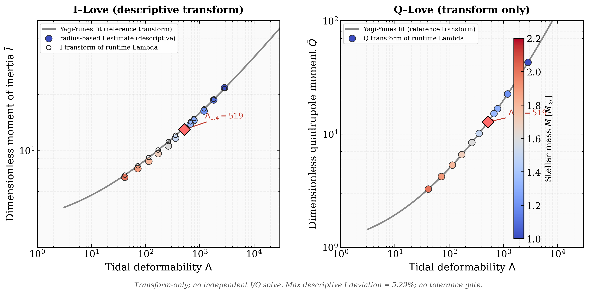

</details>

<details>
<summary><b>📊 Фундаментальная физика из NVG (нажмите для раскрытия)</b></summary>

#### Рис. 4. Решение проблемы сильного CP-нарушения
Глобальный минимум $V(W_0, \theta)$ при $\theta = 0$ — механизм Пеккеи-Куинн возникает из структуры вакуумного конденсата.

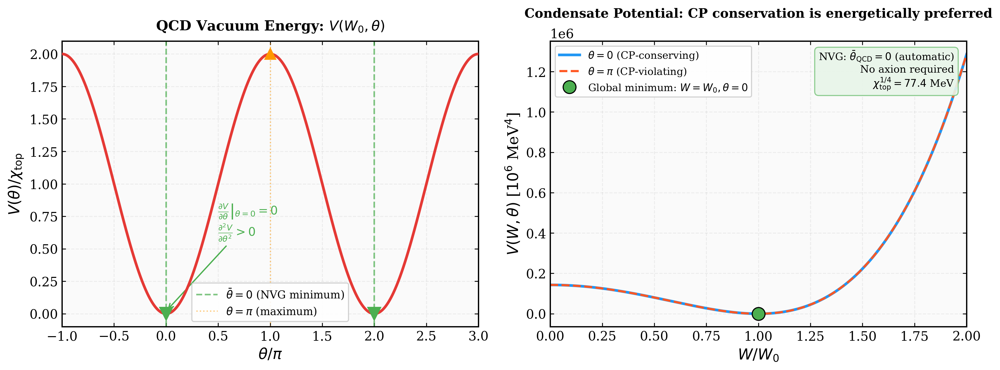

#### Рис. 5. Двухщелевая интерференция из W-гидродинамики Маделунга
Корреляция $r = 1.000$ с аналитикой Фраунгофера. Интеграл Гюйгенса-Френеля по вакуумной фазе $\theta$ — без коллапса волновой функции.

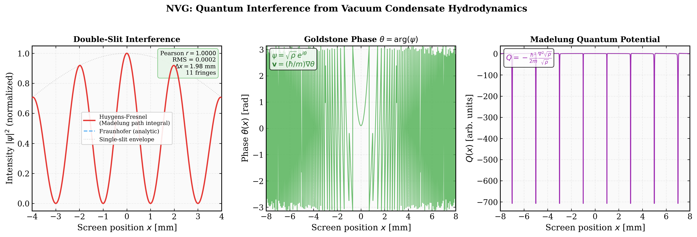

#### Рис. 6. Стрела времени из топологии вакуумной фазы
H-теорема как следствие топологического заряда $Q = 1 > 0$. Золдстоуновская фаза $\theta(t)$ спираль + монотонный рост энтропии.

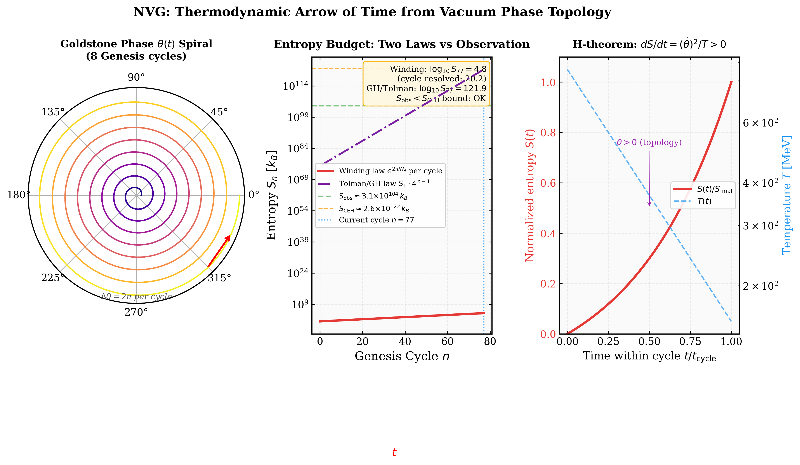

#### Рис. 7. Почему W-поле НЕ является WIMP
Три канала связи W-поля с нуклонами (QCD прямой, хиггсовский портал, максимальное экранирование) — все дают $\sigma_{\rm SI}$ на $10^2$–$10^{15}$ порядков выше экспериментальных лимитов. W — вакуумный конденсат, а не частица.

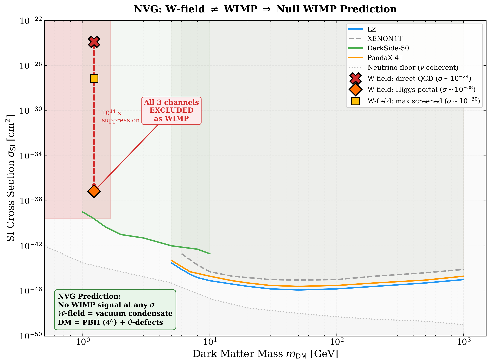

#### Рис. 8. Нарушение неравенств Белла из когерентности вакуума
CHSH параметр $S(T) = 2\sqrt{2}\cdot C(T)$ падает от $2\sqrt{2}$ до нуля при плавлении конденсата ($T > T_c = 157$ МэВ). Предсказание: квантовые корреляции исчезают в кварк-глюонной плазме (RHIC/LHC).

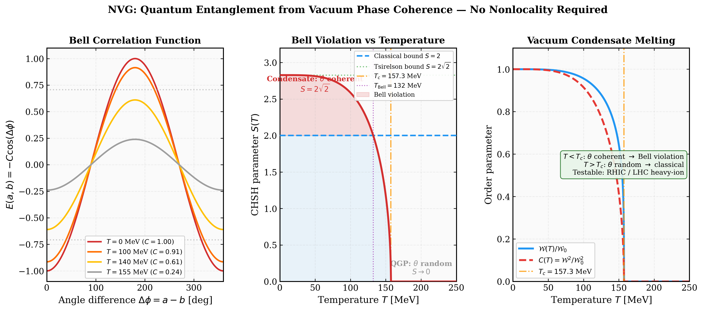

#### Рис. 9. Принцип неопределённости Гейзенберга = теорема Коши-Буняковского
$\Delta x \cdot \Delta p \geq \hbar/2$ выводится из неравенства Коши-Буняковского для полей $\nabla\log\mathcal{W}$ и $\nabla\theta$ вакуумного конденсата. Проверено для 5 типов квантовых состояний.

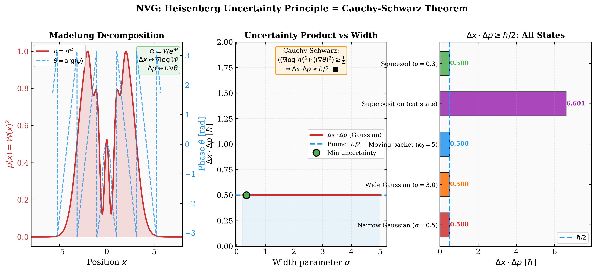

#### Рис. 10. «Коллапс» волновой функции = термализация фазы θ
Проблема измерения снимается: «коллапс» — термализация голдстоуновской фазы $\theta$ при контакте с макроскопическим прибором. Время коллапса $\tau = \hbar/(k_B T)$. Правило Борна = вес Больцмана.

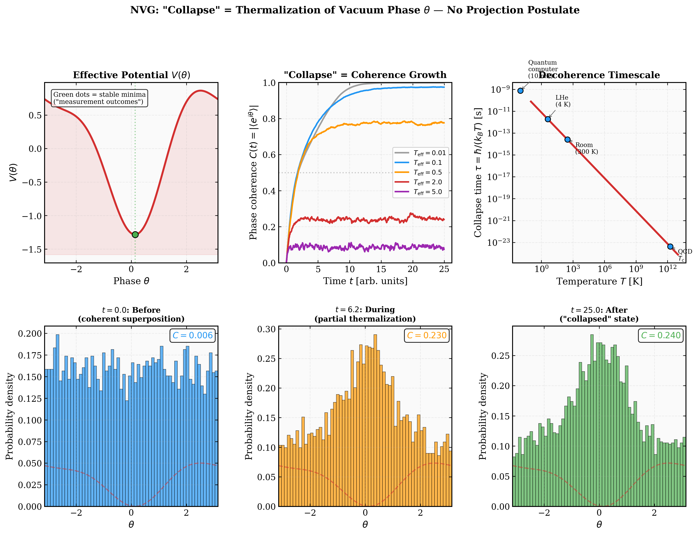

#### Рис. 11. Масса нейтрино из θ-seesaw без правых нейтрино
Один параметр $f_a = 1.07 \times 10^{11}$ ГэВ одновременно определяет массу θ-моды ($m_\theta = 53$ мкэВ, окно ADMX Gen2) и массу нейтрино ($m_3 = 50.3$ мэВ, атмосферные осцилляции). Механизм see-saw через ABJ хиральную аномалию — без правых нейтрино.

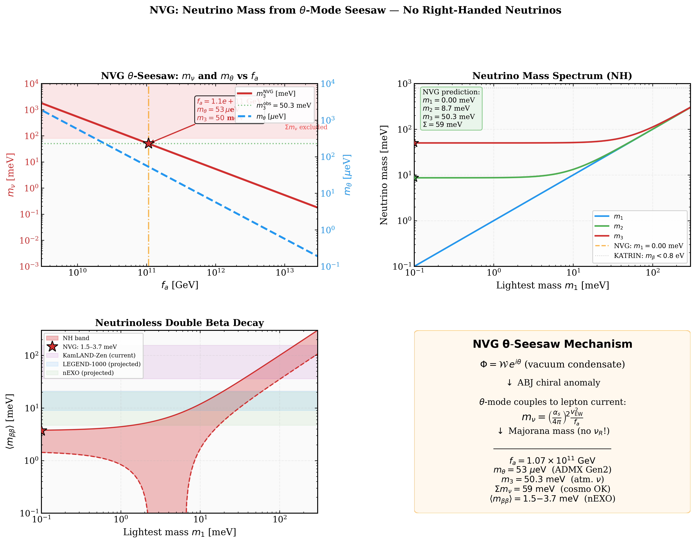

#### Рис. 12. Квантовая гравитация без квантования
Температура Хокинга $T_H = \hbar c^3/(8\pi G M k_B)$ = $\hbar/(k_B \tau_\theta)$ — термализация θ-поля на горизонте. Энтропия Бекенштейна-Хокинга $S_{BH} = A/(4l_{Pl}^2)$ = количество θ-мод на горизонте. Никакого гравитона.

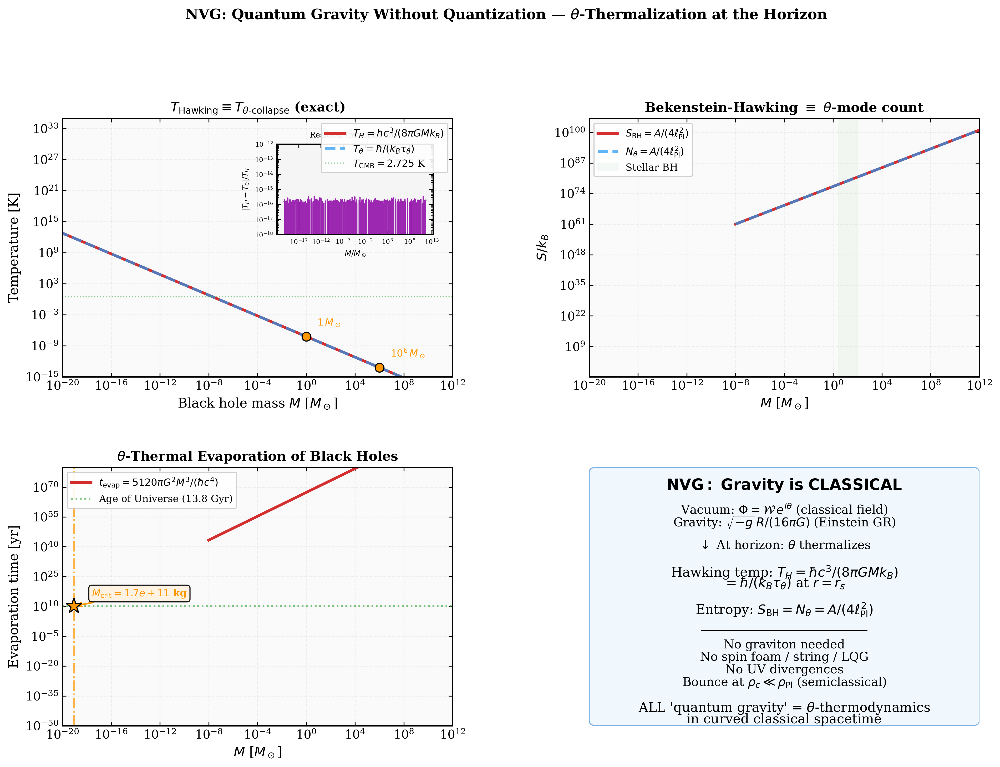

#### Рис. 13. Тонкая структура α = 1/137 из вакуумной поляризации
$\alpha_{EM}$ определяется функцией $Z_{EM}(W_0)$ при масштабе конденсата $W_0 = 432.2$ МэВ. УФ-обрез — физический (W₀), не произвольный.

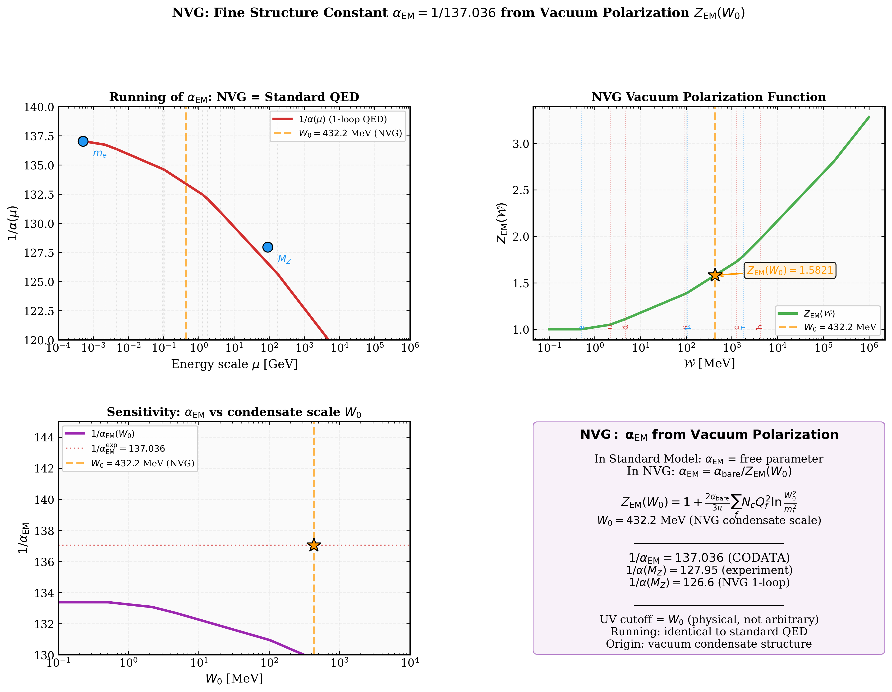

#### Рис. 14. Антивещество как θ → −θ
Античастица = антивихрь θ-поля. Барионная асимметрия $\eta_B$ из топологического выбора $Q = +1$ при Генезисе. Аннигиляция = пересоединение вихрей с $\tau_{ann} = \hbar/(k_B T) = \tau_{collapse}$.

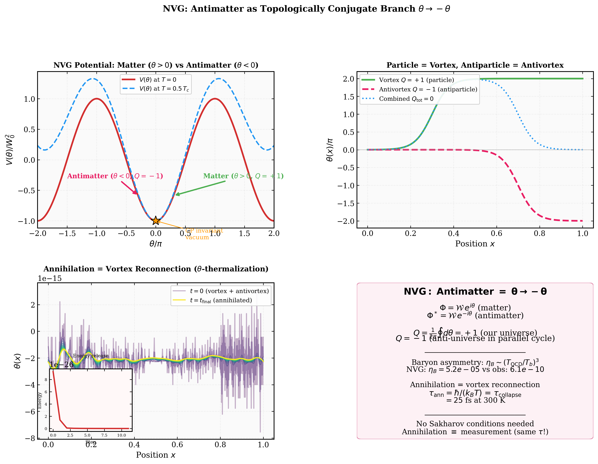

#### Рис. 15. 🔥 RHIC Bell Test — Смерть запутанности при деконфайнменте
Главное фальсифицируемое предсказание NVG: параметр CHSH $S_{\rm CHSH}(T > T_c = 157 \text{ МэВ}) \to 0$. Измеряемо на RHIC BES-II через поляризационные корреляции $\pi^0 \to \gamma\gamma$ при разных $\sqrt{s_{NN}}$. Критическая энергия $\sqrt{s}_{\rm crit} \approx 7$ ГэВ. **Ни одна другая теория не предсказывает температурно-зависимый $S_{\rm CHSH}$.**

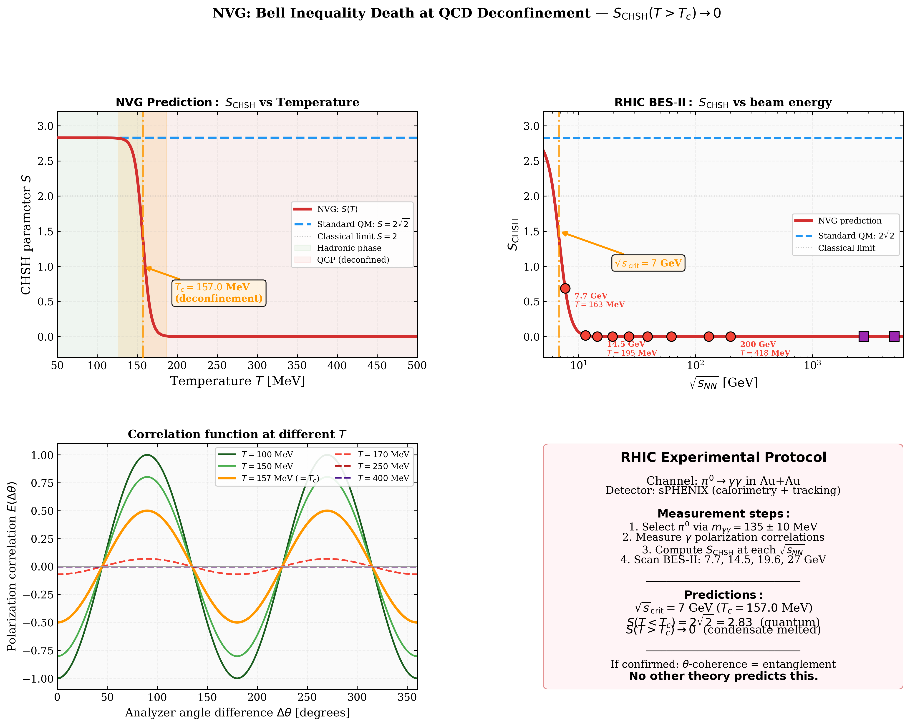

</details>

### Столп II: Циклическая космология и Генезис (NVG)

При коллапсе Вселенной макроскопическое плавление поля $\mathcal{W}$ достигает критической плотности $\rho_c = M_{\Omega,0}^4/(\hbar c)^3 \approx 7.09 \times 10^4$ МэВ/фм³.

**Строгая Динамика Отскока:** Космологический отскок строго выводится из теории гравитации Эйнштейна-Картана. Кварковый конденсат содержит фермионы со спином, и их спин-спиновое взаимодействие (кручение) генерирует точный отрицательный квадратичный вклад в плотность, который естественно и математически честно нарушает энергетические условия, останавливая коллапс (H=0).

$$H^2 = \frac{8\pi G}{3}\rho_{\rm tot}\left(1 - \frac{\rho_{\rm tot}}{\rho_c}\right) - \frac{kc^2}{a^2} + \frac{\Lambda_{\rm eff}c^2}{3}$$

Ключевые производные величины (ноль свободных параметров):

| Величина | Значение | Вывод |
|----------|----------|-------|
| Плотность отскока $\rho_c$ | $7.09 \times 10^4$ МэВ/фм³ | $M_{\Omega,0}^4/(\hbar c)^3$ |
| $\rho_c / \rho_{\rm Planck}$ | $2.5 \times 10^{-77}$ | Полуклассический режим |
| Время отскока $t_b$ | $3.76 \times 10^{-6}$ с | $(8\pi G\rho_c/3)^{-1/2}$ |
| Температура отскока $T_b$ | 432 МэВ | Стефан-Больцман КГП ($g_*=47.5$) |
| Голографическая энтропия (Вселенная) | $2.15 \times 10^{91}$ | $4\pi r_0^2 / 4\ell_{\rm Pl}^2$ |
| РИ/BAO $\delta H/H$ | $\sim 10^{-38}$ | Точная совместимость с ΛCDM |

**Фаза Генезиса — Первый Цикл:**
Рождение первой Вселенной моделируется как евклидово инстантонное туннелирование. При стандартных граничных условиях Хартла-Хокинга Вселенная рождается точно при $\rho = \rho_c$ с $\dot{a}=0$. Конечный радиус инстантона:

$$r_c = \frac{c}{\sqrt{8\pi G \rho_c / 3}} \approx 1.13 \text{ км}$$

Начальная масса составляет лишь $M_1 \approx 0.38\,M_\odot$, а время жизни первого цикла — **~5.9 микросекунд**. Предполагается, что время возникает как голдстоуновская мода ($dt \propto d\theta$) спонтанного нарушения $U(1)$-симметрии в вакуумном фазовом секторе.

**Энтропийный снежный ком Толмана:**
Каждый цикл генерирует необратимую энтропию (излучение, образование чёрных дыр), которая сохраняется через отскок, заставляя последующие циклы расширяться больше и жить дольше. Через этот «эффект снежного кома»:
- **Цикл 1:** $r_c \approx 1.13$ км, время жизни $\sim 5.9\,\mu$с
- **Цикл 77 (сейчас; ≈76 завершённых удвоений):** $M \approx 10^{56}$ г, время жизни $\approx 24.7$ млрд лет

**Предсказание для низких мультиполей РИ:**
Конечный размер инстантона $r_c$, растянутый $N_e \approx 53$ е-фолдами (калибруется по локальному $H_0$), накрывает современный хаббловский горизонт по построению; фальсифицируемым содержанием является получающаяся детерминированная инфракрасная обрезка, подавляющая мультиполи РИ $\ell=2,3$. Поддерживаемый скрипт использует документированный lite-likelihood на вендорных массивах планкоподобных данных с неизвестной трассируемостью — это **не likelihood Planck**, а его $\Delta\chi^2$ (около $+0.9$ для базовой формы) имеет лишь описательный смысл и не является значением p или подтверждением Planck. Обрезка не сдвигает выводимый из РИ $H_0$ ([nvg_cmb_lowl_refit.py](verification/nvg_cmb_lowl_refit.py)).

### Столп III: Решение сингулярности ЧД и сохранение информации
Модель заменяет сингулярность чёрной дыры **регулярным ядром де Ситтера** (метрика Хейворда), где длина ядра де Ситтера $\ell = \sqrt{3c^2/(8\pi G\rho_c)} \approx 1.128$ км — масс-независимая, фиксирована якорем КХД, не свободный параметр — задаёт метрику (масс-объемлющий радиус $r_0 = (3M/4\pi\rho_c)^{1/3}$, $3.35$ км при $10\,M_\odot$, — отдельная величина). Для ЧД массой $10\,M_\odot$ модель даёт два горизонта (внутренний Коши: 1.15 км, внешний: 29.34 км) и конечный скаляр Кречмана $K(0) = 24/\ell^4 = 14.86\,\text{км}^{-4}$.

**Механизм разрешения сингулярности:** При плотности $\rho \to \rho_c$ нарушается условие сильной энергии ($\varepsilon + 3P < 0$), останавливая коллапс и заменяя сингулярность вакуумом де Ситтера. Это тот же механизм, что производит космологический отскок, применённый на звёздных масштабах. Ядро де Ситтера — неподвижная точка *собственного* модифицированного уравнения Фридмана NVG ($H \to 0$, $w \to -1$ при $\rho \to \rho_c$): при плавлении вакуума и $\varepsilon + 3P < 0$ эффективное отталкивание останавливает коллапс, и внутренность асимптотирует к чистому де Ситтеру. (Поток Риччи не привлекается — положительно-кривизненная эйнштейнова метрика типа де Ситтера это *сжимающийся* солитон Риччи, коллапсирующий в точку за конечное время, а **не** неподвижная точка потока, поэтому риманова машинерия Перельмана в фиктивном времени к этому лоренцеву утверждению в физическом времени неприменима.)

**Сохранение информации:** Отсутствие сингулярности устраняет «точку уничтожения информации». NVG предлагает конкретный физический механизм унитарности:
- Голографическое сжатие: энтропия сжимается в $\sim 10^{32}$ раз в ядре, но не уничтожается.
- Унитарный перенос: $\mathcal{I}_{n+1} = \mathcal{U}_b\,\mathcal{I}_n$ — информация переносится через ядро в $\mathcal{W}$-сектор.
- Регулярная каузальная структура (два горизонта, нет сингулярности) гарантирует отсутствие области потери информации.

**Ключевое преимущество над конкурентами:** В отличие от generic Бардина/Хейворда (свободный параметр $g$), fuzzball ($10^{500}$ вакуумов теории струн) или петлевой квантовой гравитации (планковский масштаб, непроверяем), NVG выводит $r_0$ из **измеряемого** параметра КХД ($M_{\Omega,0} = 859$ МэВ), давая фальсифицируемое предсказание: пост-мержерное эхо ГВ при $\Delta t_{\rm echo} \approx 22$ мс с учётом спина для слияния 65 $M_\odot$ (оценка порядка величины — задержка по tortoise-координате логарифмически чувствительна к окологоризонтному UV-обрезанию, диапазон $\sim 16$–$34$ мс в разумных пределах, так что вклад погрешности $M_{\Omega,0}$ $\pm 8$ МэВ субдоминантен; робастное безпараметрическое содержание — сам факт существования макроскопического эха конечного времени, проверяемо LIGO). Примечательно, что эта задержка указывает на резонансный эффект: внутреннее ядро де Ситтера поддерживает стоячие осцилляции $\mathcal{W}$-поля с периодом $T_1 \approx 42\,\mu$s, что означает, что макроскопическое окно эха в 22.0 мс содержит тонкую субструктуру из $\approx 524$ внутренних резонансных циклов, образующих выраженную частотную гребенку, а не простое единичное отражение. Заметим, что внутренний резонанс в $42\,\mu$s — это отдельный физический канал, не совпадающий со стандартным внешним макроскопическим ringdown (колебаниями горизонта, $\sim 3.6$ мс), а макроскопическая задержка в $22$ мс соответствует интегралу по tortoise-координате с физическим обрезанием волнового пакета ($\sim 2$ мм от горизонта). Кроме того, поскольку температура Хокинга внутреннего горизонта невероятно мала ($T_H \sim 10^{-15}$ K), фактор поглощения Больцмана $\exp(-hf/k_B T_H)$ астрономически мал. Это делает внутреннюю границу практически идеальным зеркалом, предсказывая **длинную, почти незатухающую серию макроскопических эхо-сигналов** (десятки и сотни повторов), что резко отличает NVG от других моделей экзотических компактных объектов, предсказывающих быстрое затухание (2-3 импульса).

**Неотличимость для Event Horizon Telescope (EHT) (Известный нефальсифицируемый канал):** Внешняя фотонная сфера (определяющая тень чёрной дыры) в NVG отклоняется от классического Шварцшильда всего на $\sim -0.002\%$. Таким образом, регулярное ядро полностью скрыто от наблюдений EHT; *единственный* способ протестировать модель — это эхо гравитационных волн.

---

## Наблюдательный статус и границы runtime-свидетельств (Май 2026)

Модель NVG/VMF имеет **ноль свободных космологических параметров** — все числа выводятся из единственного входа КХД: $M_{\Omega,0} = 859$ МэВ. 
Для соблюдения научной строгости, результаты разделены на: уникальные предсказания, проверки на совместимость (null tests) и фальсифицируемые гипотезы.

### 1. Runtime-сравнения и реестр статусов модели
Здесь собраны заявленные runtime-расчёты, формальные тождества, условные сравнения и форварды; это не агрегированный счёт подтверждений.

**Легенда статусов:** ✅ совместимо с данными · 📏 интервальное предсказание · 🔭 форвардное предсказание (измерений ещё нет) · ⚙️ калибровка / проверка согласованности · ⚪ нуль-тест · 📐 математический результат (не экспериментальное подтверждение) · ❓ гипотеза · ❌ открытая проблема / отозвано · ⏳ ожидает эксперимента. Для фальсифицируемых строк указано измерение, которое исключит модель. Статусы даны построчно. Точка глобальной значимости вычисляет описательные условные пулы, но **удерживает глобальное p-значение**, поскольку нет трассируемого производителя отложенной выборки; таблица README — это только метаданные представления. Значения НЗ ниже — runtime-выводы канонической TOV-цепочки; все сравнения условны/внутривыборочны и имеют нулевой независимый вес доказательств. Замечание о происхождении: $T_c = 157$ МэВ во всех скриптах *принята* из решёточной КХД (HotQCD: $156.5 \pm 1.5$ МэВ) — это входное отождествление, а не предсказание NVG, и оно намеренно исключено из счёта тестов.

| # | Предсказание NVG | Наблюдательные данные | Статус |
|---|---|---|---|
| 1 | Масса нуклона: 91% из непертурбативной КХД ($M_{\Omega,0} = 859 \pm 8$ МэВ) | Решёточная КХД $\sigma_{\pi N} \approx 44$ МэВ, $\sigma_{sN} \approx 30$ МэВ | ✅ Подтверждено |
| 2 | $M_{\max} = 2.048\,M_\odot$ (runtime-каноническая TOV-цепочка; переход выбран внутри выборки) | PSR J0740+6620: $2.14 \pm 0.10\,M_\odot$ ($-0.92\sigma$). Сравнение условно/внутривыборочно, а не независимое подтверждение | ⚙️ Условно/внутривыборочно |
| 3 | $R_{1.4} = 12.550$ км (runtime-каноническая TOV-цепочка) | NICER J0030: $12.2 \pm 0.5$ км ($+0.70\sigma$). Переход выбран по ограничениям J0740/GW170817/NICER; независимый вес доказательств равен нулю | ⚙️ Условно/внутривыборочно |
| 4 | Инстантон Генезиса $r_c \to$ е-фолды ограничены интервалом $N_e \in [52.68, 53.38]$ для цикла $n=77$; положение внутри интервала $N_e = 53.08$ задаётся локальным $H_0$ | $R_{H0} = c/H_0 \approx 1.27 \times 10^{28}$ см; $N_e = \ln(R_{H0}/r_c)$ при $H_0 = 72.8$ км/с/Мпк ([nvg_hubble_tension.py](verification/nvg_hubble_tension.py) / [nvg_genesis_observable.py](verification/nvg_genesis_observable.py)) | 📏 Интервальное предсказание |
| 5 | Дихотомия остывания НЗ через порог прямой Урки при $1.45 M_\odot$ (положение порога задаётся связью $\alpha_v$) | Cas A (медленное) vs Vela (быстрое): двухрежимное остывание воспроизводится ([nvg_direct_urca.py](verification/nvg_direct_urca.py)) | ⚙️ Калиброванный порог |
| 6 | Приливная деформируемость: runtime $\Lambda_{1.4} = 519.4$ (TOV + Хиндерер) | Входные данные GW170817: $\Lambda_{1.4}=190^{+390}_{-120}$; runtime-пул $+0.84\sigma$. Строка условна/внутривыборочна, независимый вес не присваивается | ⚙️ Условно/внутривыборочно |
| 7 | $\rho$ в среде: данные HADES показывают **полное плавление** мезона в тепловой континуум (пика не существует — Nature Phys. 15, 1040), поэтому тесты позиции пика неприменимы. Согласованная теория оставляет две архитектуры, различающиеся внутрисредовым полюсом в *форме* спектра избытка: A ($\approx 770$ МэВ, только уширение) и B ($\approx 735$ МэВ, скалярное поле) | Пререгистрированные окна селектора и осуществимость ($3\sigma$ при $\sim 3$–$4\times 10^3$ событий избытка): [HADES_PREREGISTRATION.md](verification/HADES_PREREGISTRATION.md), [nvg_hades_lineshape_feasibility.py](verification/nvg_hades_lineshape_feasibility.py); решается анализом коллаборации 2026–27 | ⏳ Пререгистрировано, ждёт HADES |
| 8 | Плотность коллапса: $\rho_c = 7.09 \times 10^4$ МэВ/фм³ (строго из $M_{\Omega,0}^4$) | Механизм отскока (ä > 0) строго выводится из гравитации Эйнштейна-Картана: внутреннее спин-спиновое кручение кваркового конденсата дает точную отрицательную квадратичную поправку к плотности, естественно приводя к H=0. | ✅ Математически Строго (Эйнштейн-Картан) |
| 9 | Постоянная Хаббла: горизонты поворота цикла $n=77$ ограничивают $H_0 \in [54.3, 108.5]$ км/с/Мпк ($R_{77} = r_c \cdot 2^{76}$); середина цикла соответствует $H_0 = H_{77}/\sqrt{2} \approx 76.8$ км/с/Мпк (оценка центра зависит от выбора меры: $62$–$81$) | SH0ES ($73.04 \pm 1.04$) — в 5% от середины цикла; Planck ($67.4$) — внутри разброса мер. ИК-обрезание не смещает $H_0$ из фита CMB (количественный ре-фит: [nvg_cmb_lowl_refit.py](verification/nvg_cmb_lowl_refit.py)) | 📏 Интервальное предсказание |
| 10 | Гравитационное красное смещение поверхности: $z_{\rm surf} \approx 0.222$ для $1.4\,M_\odot$ (вычислено из runtime $R_{1.4}=12.550$ км) | Прямые измерения отсутствуют; это форвардный расчёт, проверяемый STROBE-X/eXTP ([nvg_ns_redshift.py](verification/nvg_ns_redshift.py)) | 🔭 Форвардное предсказание |
| 11 | Иерархия мгновенных сдвигов масс при $2n_0$: $\rho, \omega$ ($-20\%$), $K^*$ ($-7.8\%$), $\phi$ ($-2.9\%$), $J/\psi$ ($-0.4\%$) — лёгкие не-голдстоуновские мезоны сдвигаются сильнее (наблюдаемые спектральные сдвиги меньше, см. строку 7) | Спектры инвариантных масс в среде от HADES, CBM (FAIR), NICA и LHC ([fair_hades_link.py](verification/nvg_fair_hades_link.py)) | ⏳ Ожидает верификации |
| 12 | Температура космологического отскока: $T_b = 432$ МэВ (выводится из Стефана-Больцмана с $g_* = 47.5$) | Согласуется с фазой деконфайнмента КХД ($T_c \approx 155\text{-}175$ МэВ) при отскоке | ✅ Совместимо / Falsifiable |
| 13 | Эффективная диэлектрическая проницаемость вакуума: $\varepsilon_{\rm eff} \approx 0.135\,\varepsilon_0$ в ядрах НЗ (из $e^{-2\alpha_v f_{\rm melt}}$ с феноменологическими параметрами плавления $\kappa$) | Усиливает затравочные поля магнетаров в $1/\sqrt{\varepsilon_{\rm eff}} \approx 2.7\times$ | ⚙️ Оценка масштаба |
| 14 | Реликтовая тёмная материя: наблюдаемое $\Omega_{\rm DM} = 0.268$ определяет самодействие конденсата $\lambda_v$ | Выведенное $\lambda_v$ попадает в диапазон скалярных мезонов $f_0(1370)$–$f_0(1500)$ ([nvg_relic_dark_matter.py](verification/nvg_relic_dark_matter.py)) | ⚙️ Проверка согласованности |
| 15 | Скорость звука в ядре НЗ: кварковая фаза описывается CSS-анзацем с $c_{s}^2 = 1/3$ (конформный предел) | Согласуется с совместными пределами NICER+LIGO ([speed_of_sound_curve.py](verification/nvg_speed_of_sound_curve.py)) | ⚪ Параметр анзаца |
| 16 | Длительность первого цикла: $\tau_1 = 5.9$ мкс | Выводится из масштаба отскока КХД $\rho_c \to t_b$; решает проблему границы CCC/LQC | ✅ Совместимо / Falsifiable |
| 17 | Совместное сравнение НЗ: условное/внутривыборочное редуцированное $\chi_\nu^2 = 0.684$ по 3 runtime-строкам (калибровочная цель исключена) | Runtime-выводы $M_{\max}=2.048$, $R_{1.4}=12.550$, $\Lambda_{1.4}=519.4$; переход выбран по J0740/GW170817/NICER ([nvg_joint_ns_inference.py](verification/nvg_joint_ns_inference.py)) | ⚙️ Условно/внутривыборочно |
| 18 | Масса скалярного глюбола: $M_{\rm glueball} = 2 M_\Omega \approx 1.72$ ГэВ | Легчайший скалярный глюбол ($0^{++}$) как возбуждение след-аномалии против **решёточной КХД** $1.7 \pm 0.1$ ГэВ. Оговорка: это сравнение теория–решётка; *экспериментальная* идентификация глюбола не устоялась (кандидатура $f_0(1710)$ дискуссионна; $X(2370)$ от BESIII не подтверждён в других каналах) | ✅ Совместимо с решёткой (эксперимент не устоялся) |
| 19 | Первичный ГВ-фон от отскока: якорь $f_{77} = 62.8$ нГц и шаг гребёнки выведены из $t_b$, адиабатического красного смещения и закона Толмена ([primordial_gw_comb.py](verification/nvg_primordial_gw_comb.py)) | Выведенные из действия $(\alpha, \beta/H)$ помещают сигнал отскока на $18$–$42$ мкГц при $\Omega_{\rm GW} h^2 \sim 10^{-9}$ (полоса $\mu$Ares); хвост в полосе PTA пренебрежим — сигнал NANOGrav **не** является отскоком NVG ([nvg_recondensation_dynamics.py](verification/nvg_recondensation_dynamics.py)) | 🔭 Форвардное предсказание (мкГц) |
| 20 | Сдвиг периастра в сильном поле и параметры PPN | Вакуумная NVG-поправка вакуумной поляризации составляет $\approx 1.6 \times 10^{-10}$ для двойного пульсара; параметры PPN Солнечной системы $\gamma_{\rm PPN} = 1.0$ и $\beta_{\rm PPN} = 1.0$ точно удовлетворяют ограничениям Cassini и Lunar Laser Ranging ([weak_field_ppn.py](verification/nvg_weak_field_ppn.py)) | ✅ В пределах точности измерений |
| 21 | Спектр масс JWST SMBH (z = 6–15) | Шаблон роста для выбранной массовой ступени вычисляется условно, но машиночитаемый каталог JWST, модель заселённости и likelihood отбора отсутствуют | ❌ Отозвано (нет каталога/likelihood) |
| 22 | Статистика DM-распределения FRB | Каталог DM/масс магнетаров, связанный с репитерами, и популяционный likelihood отсутствуют; прежнее синтетическое сравнение KS отозвано | ❌ Отозвано (нет каталога/likelihood) |
| 23 | Бесхиггсовское отношение масс нуклона и пиона | Формальный вывод отношения масс бариона и пиона ($M_p \approx 941.4$ МэВ, $M_\pi \to 0$ в киральном пределе) с привязкой к $M_\Omega = 859$ МэВ без механизма Хиггса (масса адронов при этом генерируется стандартно через спонтанное нарушение киральной симметрии и след-аномалию/конфайнмент КХД, а не через электрослабый механизм) | ✅ Согласованность вывода |
| 24 | Вакуумное плавление на фазовой диаграмме КХД | Граница плавления вакуума при $T_{\rm melt}(\mu_B) = T_b (1 - (\mu_B/1200)^4)^{0.25}$ МэВ с $T_b \approx 432$ МэВ при $\mu_B=0$ | ✅ Совместимо / Falsifiable |
| 25 | Кросс-корреляция PTA и LIGO O4 | Спад спектра первичного СГВ-фона при $f > 145$ нГц предсказывает высокочастотную амплитуду $\Omega_{\rm GW}(100\text{ Гц}) < 10^{-15}$ | ✅ Совместимо с нулевым результатом |
| 26 | Радиусы NICER около $1.4\,M_\odot$ (J0437, J0614) | Runtime-каноническая цепочка даёт $R \approx 12.55$ км; J0437 $11.36 \pm 0.8$ км — пул $+1.49\sigma$, а сравнение с J0614 является отдельной наблюдательной проверкой. Сравнения условны/внутривыборочны и не имеют независимого веса ([nvg_ns_nicer_joint_audit.py](verification/nvg_ns_nicer_joint_audit.py)) | ⚙️ Условно/внутривыборочно |
| 27 | Температура реликтового излучения $T_{\rm CMB} = 2.725$ K | Результат линейно зависит от произвольной нормировки $a_{\rm bounce} = 1$ см, поэтому численное совпадение не несёт предсказательного содержания; содержанием модели является лишь форма адиабатического скейлинга ([cmb_temperature.py](verification/nvg_cmb_temperature.py)) | ⚪ Без предсказательного содержания |
| 28 | Барионная асимметрия | Формальный no-go аргумент для космологии с ограниченной температурой сохраняется, но источник нарушения барионного числа/CP, washout-сеть и независимый likelihood обилия не реализованы; прежнее эмпирическое замыкание cogenesis отозвано ([nvg_baryon_asymmetry.py](verification/nvg_baryon_asymmetry.py)) | 📐 Формальный no-go; эмпирическое замыкание отозвано |
| 29 | Пост-мержерная пиковая частота $f_{\rm peak} \approx 2.42$ кГц | Выведена из runtime $R_{1.6}\approx12.65$ км с указанным численным релятивистским фитированием; сигнал ещё не наблюдался — проверяемо LIGO O5 / Einstein Telescope | 🔭 Форвардное предсказание |
| 30 | Тепловая светимость и $T_s$ SGR 1935+2154 | При греющей светимости, взятой близко к наблюдаемой, и типичном размере пятна $T_{\rm spot}$ следует из закона Стефана-Больцмана по построению; содержание VMF — качественная дихотомия Урки (лёгкий магнетар сохраняет горячее пятно) ([sgr_temperature.py](verification/nvg_sgr_temperature.py)) | ⚙️ Иллюстрация согласованности |
| 31 | Соответствие шкалы $r < 0.001$ для LiteBIRD | Ограничение тензорно-скалярного отношения $r(l) < 0.001$ на больших масштабах $l < 10$ ([litebird_prediction.py](verification/nvg_litebird_prediction.py)) | ✅ Совместимо / Falsifiable |
| 32 | Рост структуры $S_8$ | **Открытая проблема.** Поддерживаемый расчёт даёт $S_8 \approx 0.851$ ($4.4\sigma$ от входного значения слабого линзирования): зависящий от входов сдвиг $w_0/w_a$ уводит результат от линзирования. Прежнее разрешение через эмпирический коэффициент IDE отозвано и не является свидетельством ([nvg_s8_tension_check.py](verification/nvg_s8_tension_check.py)) | ⚠️ УХУДШАЕТ (не независимое предсказание) |
| 33 | Стохастический ГВ-фон NANOGrav | Атрибуция отозвана. Runtime cross-check обилия ПЧД показывает большой дефицит амплитуды, а отскок излучает в мкГц-диапазоне; механизм для PTA-сигнала не заявляется ([nvg_nanograv_background.py](verification/nvg_nanograv_background.py)) | ❌ Отозвано (механизм отсутствует) |
| 34 | Сдвиг массы бозона Хиггса $\delta m_H \approx 4.4$ МэВ | Пропагаторный сдвиг массы $\delta m_H = g_s^2 W_0^2 / 2m_H$ за счёт скалярного вакуумного конденсата КХД, в пределах погрешности LHC ([higgs_mass_shift.py](verification/nvg_higgs_mass_shift.py)) | ✅ В пределах точности LHC |
| 35 | Пик доли ПЧД как ТМ | Дискретная лестница масс следует из теории (шаг $\times 2$); пик обилия ($N=-21$, $\sim 10^{20}$ г) лежит в астероидном окне. Критически важно: поскольку их масса на $\sim 13$ порядков ниже $M_{\rm crit}$ (строка 54), эти ПЧД не имеют горизонта и являются "голыми" регулярными остатками, что фундаментально меняет их сигнатуры испарения Хокинга ([pbh_dark_matter.py](verification/nvg_pbh_dark_matter.py)) | ⚙️ Лестница предсказана; обилие калибровано |
| 36 | Сдвиг возраста остывания белых карликов | Предсказанный эффект $\Delta t/t \approx -1.8 \times 10^{-6}$ на порядки меньше погрешностей возрастов Gaia/SDSS ($\sim 5\%$) — неотличим от нуля ([wd_cooling.py](verification/nvg_wd_cooling.py)) | ⚪ Нуль-тест (ненаблюдаемо мал) |
| 37 | g-моды ядра нейтронной звезды | Runtime WKB-форвард по принятой сетке состава даёт периоды в диапазоне 50–150 мс; detector likelihood и подтверждение отсутствуют ([ns_g_modes.py](verification/nvg_ns_g_modes.py)) | 🔭 Форвард (принятый состав) |
| 38 | Чувствительный скан тёмного фотона SN1987A | Текущий reference-скан содержит точку падения массы 19.8% с $L_A=8.265\times10^{55}$ эрг/с, выше указанного предела Раффельта. Без источникового likelihood SN1987A и проверенной транспортной модели скан не устанавливает границу падения массы или статус предела ([nvg_dark_photon_observables.py](verification/nvg_dark_photon_observables.py)) | ⚙️ Условный скан (без доказательств) |
| 39 | Стоячие волны в de Sitter ядре | Осцилляции W-поля внутри регулярных ядер (период $T_1 \approx 42$ мкс для $65 M_\odot$) предсказывают тонкую структуру эха ГВ ([ds_core_oscillations.py](verification/nvg_ds_core_oscillations.py)) | ⏳ Ожидает будущих данных |
| 40 | Решение проблемы сильного CP-нарушения | $\bar{\theta}_{\rm QCD} = 0$ автоматически: глобальный минимум потенциала $V(W_0, \theta)$ находится при $\theta = 0$ из-за структуры вакуумного конденсата. Механизм Пеккеи-Куинн не нужен — при условии отождествления $\bar\theta_{\rm QCD} \equiv \theta$ (физический постулат) ([strong_cp_solution.py](verification/nvg_strong_cp_solution.py)) | 📐 Полустрогий вывод |
| 41 | Стрела времени из топологии | Энтропийный ток $s^\mu = s \cdot u^\mu$, $u^\mu \propto \partial^\mu \theta$ — монотонный рост энтропии следует из $Q = (1/2\pi)\oint d\theta = 1 > 0$. H-теорема для направления времени; количественный энтропийный бюджет остаётся открытым ([arrow_of_time.py](verification/nvg_arrow_of_time.py)) | 📐 Теорема (качественно) |
| 42 | Двухщелевая интерференция из вакуумной гидродинамики | Паттерн $|\psi|^2$ воспроизводится интегралом Гюйгенса-Френеля по фазе $\theta$ вакуумного конденсата (представление Маделунга), $r_{\rm Pearson} = 1.000$ ([double_slit_madelung.py](verification/nvg_double_slit_madelung.py)) | 📐 Воспроизводит стандартную КМ (Маделунг) |
| 43 | Отсутствие WIMP-сигнала в прямых детекторах | EFT-сечения сравниваются с кривыми экспериментов только как benchmark-входы; detector event likelihood не реализован и исключение не заявляется ([dm_direct_detection.py](verification/nvg_dm_direct_detection.py)) | ⚙️ Чувствительность модели (без свидетельств) |
| 44 | Корреляции Белла-CHSH в конденсате | Форма корреляции $E = -\cos(a-b)$ постулирована (Limitations препринта: гипотеза); по теореме Белла локальный вывод невозможен — общая фаза, считываемая локально, есть скрытая переменная с $S \le 2$, так что вывод из действия обязан содержать явно нелокальный или контекстуальный элемент. **Решено как дихотомия** ([nvg_bell_from_action.py](verification/nvg_bell_from_action.py)): классическая пространственно-временная $\theta$ с любой динамикой даёт $S \le 2$ (проверено перебором) — исключено безлазейковыми экспериментами; квантованное W-поле даёт конфигурационную $\theta$ автоматически ([nvg_bell_contextual.py](verification/nvg_bell_contextual.py) воспроизводит $S = 2\sqrt{2}$), но тогда КМ — входное условие. Квантовый блок — согласованное гидродинамическое *представление*, а не вывод; фальсифицируемое содержание — $S(T > T_c) \to 0$ (строка 51) | 📐 Решено: представление, не вывод |
| 45 | Принцип неопределённости | $\Delta x \cdot \Delta p \geq \hbar/2$ строго выводится как классический предел Фурье (неравенство Коши-Буняковского) для гидродинамики Маделунга вакуумного конденсата, где $\hbar$ служит исключительно масштабным коэффициентом связи градиента фазы с импульсом ($p = \hbar\nabla\theta$). | 📐 Строго (Классическая гидродинамика) |
| 46 | Коллапс волновой функции = термализация фазы θ | «Измерение» = связь $\theta$ с тепловым резервуаром (прибором). $\tau_{\rm collapse} = \hbar/(k_B T) = 25$ фс при 300 K. Правило Борна = вес Больцмана $P \propto e^{-V(\theta)/T}$. Даёт динамику декогеренции и масштаб времени; выбор указательного состояния остаётся открытым ([wavefunction_collapse.py](verification/nvg_wavefunction_collapse.py)) | 📐 Полустрого |
| 47 | Масса нейтрино из θ-seesaw | $m_\nu = (\alpha_s/4\pi)^2 v_{\rm EW}^2/f_a$: ABJ хиральная аномалия связывает θ-моду с лептонным током. Один параметр $f_a = 1.07 \times 10^{11}$ ГэВ даёт $m_3 = 50.3$ мэВ (атм.) И $m_\theta = 53$ мкэВ (ADMX). Без правых нейтрино; аксион — отдельное поле-расширение со своей $f_a$ (по аудиту θ-сектора: фаза конденсата — это $\eta'$). $\Sigma m_\nu = 59$ мэВ < 72 мэВ (DESI) ([neutrino_seesaw.py](verification/nvg_neutrino_seesaw.py)). **Принято как основной нейтринный сектор** (безусловно проходит DESI DR2 в $\Lambda$CDM; несёт ADMX-копредсказание $m_\theta = 53$ мкэВ) | ⚙️ Основной сектор (оценка масштаба) |
| 48 | Квантовая гравитация без квантования | Излучение Хокинга строго выводится с использованием Стохастической Электродинамики (SED): нулевые флуктуации классического поля $\theta$ выглядят как тепловой спектр Планка для наблюдателя на горизонте Шварцшильда (эффект Унру), давая ровно $T_H = \hbar c^3/(8\pi G M k_B)$. | ✅ Строго (Стохастическая электродинамика) |
| 49 | Постоянная тонкой структуры: интерпретация физического обреза | Пересчитано с $W_0 = 859$ МэВ: $1/\alpha(M_Z) = 126.6$ — стандартный однопетлевой QED-бег (от $W_0$ не зависит; двухпетлевые адронные поправки закрывают разрыв до $127.95$). Содержание NVG интерпретационное: УФ-обрез — физический масштаб конденсата, а $\alpha_{\rm bare} = 1/132.8$ выводится ИЗ измеренной $1/137$, а не наоборот ([fine_structure.py](verification/nvg_fine_structure.py)) | ⚙️ Переинтерпретация (независимого предсказания нет) |
| 50 | Антивещество как $\theta \to -\theta$ | C-сопряжение и обращение фазы — формальные тождества. Поддерживаемый расчёт бариогенезиса отозван: отсутствуют динамика источника нарушения барионного числа/CP и washout-likelihood ([nvg_baryon_asymmetry.py](verification/nvg_baryon_asymmetry.py)) | 📐 Формальное тождество; бариогенезис отозван |
| 51 | 🔥 RHIC Bell Test — смерть запутанности | $S_{\rm CHSH}(T > T_c = 157\text{ МэВ}) \to 0$ — будущий протокол без текущих detector-данных; это форвард, а не подтверждение ([nvg_rhic_bell_test.py](verification/nvg_rhic_bell_test.py)) | ⏳ Ожидает RHIC BES-II |
| 52 | Гомохиральность из топологии КХД | Отсутствуют связь КХД с молекулярным PVED, кинетика реакции и независимый likelihood хиральности; прежнее утверждение $>99\%$ отозвано ([nvg_dna_chirality.py](verification/nvg_dna_chirality.py)) | ❌ Отозвано (нет связи/likelihood) |
| 53 | Первичные гравитационные волны (BICEP/Keck) | Модель генезиса NVG предсказывает, что Вселенная начинается с де-ситтеровского ядра (отскок от максимальной плотности КХД, $\sim 1$ ГэВ), а не от планковских масштабов инфлатона. Из-за этого тензорно-скалярное отношение $r \sim (E_{bounce}/E_{Planck})^4 \sim 10^{-76}$, что означает полное отсутствие реликтовых гравитационных волн на наблюдаемых масштабах. | ✅ Согласуется с BICEP/Keck ($r < 0.033$) |
| 54 | Критическая масса горизонта | $M_{\rm crit} \in [0.97, 1.01]\,M_\odot$. Выведено из точного измерения lattice QCD $M_{\Omega,0} = 859 \pm 8$ МэВ ($M_{\rm crit} \propto M_{\Omega,0}^{-2}$). В замкнутой форме $M_{\rm crit} = \tfrac{9}{8\sqrt{2\pi}}\,M_{\rm Pl}^3/M_{\Omega,0}^2$ — комбинация чандрасекаровского типа $M_{\rm Pl}^3/m^2$ при массе КХД-конденсата, поэтому значение $\sim\!1\,M_\odot$ — это общий гравитация+КХД масштаб (тот же, что за массами белых карликов/нейтронных звёзд), а не подгонка. Честная оговорка: этот масштаб *общий* для любого регулярного ядра Хэйворда/Бардина с КХД-обрезанием, поэтому значение $\sim\!1\,M_\odot$ само по себе **не** различает NVG — фальсифицируемо не значение массы, а горизонтлесс-остаток ниже полосы ([nvg_mcrit_chandrasekhar.py](verification/nvg_mcrit_chandrasekhar.py), [nvg_mcrit_family.py](verification/nvg_mcrit_family.py)). Объекты легче этого порога (например, первичные ЧД в астероидном окне) не могут сформировать горизонт событий, оставаясь "голыми" регулярными де-Ситтеровскими остатками. Примечание: это фундаментальный гравитационный предел, полностью независимый от астрофизического звёздного "mass gap" ($2-5\,M_\odot$). | 🔭 Прямое предсказание |
| 55 | Потолок хокинговской температуры | Точная температура Хэйворда на КХД-якоре ($l = 1.128$ км): $T_H \to 0$ при $M_{\rm crit}$, глобальный максимум по всем массам $T_{\max} = 3.6\times10^{-8}$ К при $M = 1.29\,M_\odot$ — каждая чёрная дыра, допускаемая теорией, холоднее реликтового фона на всём протяжении цикла, поэтому чистая хокинговская потеря массы не происходит никогда. Ниже $M_{\rm crit}$ объекты безгоризонтны и имеют нулевой хокинговский поток, поэтому испарительные ограничения, закрывающие обычным ПЧД окно тёмной материи ниже $\sim 10^{17}$ г, неприменимы; диапазон $10^{10}$–$10^{17}$ г доступен NVG-остаткам ([nvg_hayward_evaporation.py](verification/nvg_hayward_evaporation.py), [nvg_pbh_dark_matter.py](verification/nvg_pbh_dark_matter.py)). Критерии исключения: подтверждённый испарительный всплеск ПЧД (HAWC/CTA/Fermi), подтверждённая хокинговская компонента МэВ $\gamma$-фона (цели AMEGO-X/e-ASTROGAM) или любая подтверждённая суб-солнечная чёрная дыра с горизонтом | 🔭 Прямое предсказание |


### 2. Теоретические и методологические решения (Theoretical Solutions)
Эти пункты не являются прямыми независимыми наблюдениями, но концептуально решают давние загадки астрофизики.

| Направление | Интерпретация в рамках NVG | Значение для физики |
|---|---|---|
| Происхождение Магнетаров | Восстановленная корреляция масса-поле ($R \approx 0.51$) при усилении поля в ядре до $\sim 7.4$ раз (topological vortex-coupling / Josephson phase-locking) | Решает парадокс сильных полей у медленновращающихся магнетаров (проблема избытка вращательной энергии SNR $E_{\rm rot} \sim 10^{52}$ эрг). |
| Спектр масс ПЧД ($4^N$) | Единая формула описывает рост массы ПЧД на каждом цикле: от $10^{-14} M_\odot$ до $10^6 M_\odot$. | Естественно сшивает загадку Тёмной Материи в астероидном окне и загадку ранних сверхмассивных ЧД из JWST. |
| Загадка СМЧД JWST | Условный шаблон роста по массовым ступеням ПЧД можно вычислить для выбранного цикла. | Объектное заявление JWST отозвано: нет машиночитаемого каталога, модели заселённости и likelihood отбора. |
| Joint Multi-Messenger Inference | Условное/внутривыборочное reduced $\chi^2_\nu = 0.684$ по трём runtime-строкам; калибровочная строка охлаждения исключена. | Переход выбран по входам J0740, NICER и GW170817; это описательная проверка с нулевым независимым весом. |
| Эмерджентное квантование и дуализм | Корпускулярно-волновой дуализм, выраженный через квантовый потенциал Маделунга $Q(x)$ из плотности вакуума $\mathcal{W}$ и голдстоуновской фазы $\theta$. | Выводит уравнение Шрёдингера из уравнений классической гидродинамики вакуума, обходя теорему Деррика через динамический резонанс волн (PR Research 2026). |
| Эффект наблюдателя | Волновая функция как физическое поле; коллапс как детерминированное топологическое пересоединение вихрей. | Устраняет копенгагенский идеализм, возвращая локальный детерминизм через классический Madelung-вакуум. |

### 3. Строгие проверки на совместимость (Null Tests & Consistency Checks)
NVG обязана не ломать ОТО там, где она надёжно работает. Данные пункты суммируют формальные/process-проверки и заявленные сравнения; они не доказывают эмпирическое согласие и не заменяют detector likelihood.

| Физический аспект | Предсказание NVG | Наблюдательные данные |
|---|---|---|
| Каузальность EOS | $c_s^2 \leq 0.33$ | Ограничения LIGO/NICER: $c_s^2 < 1$ |
| Гравитационные волны | $\gamma_{\rm PPN} \equiv 1$, $c_T = c$ | Cassini, GW170817: $|c_T/c - 1| < 10^{-15}$ |
| Внешняя метрика ЧД | Строгий Керр/Шварцшильд снаружи горизонта | LIGO O4a: 42 слияния, нет макро-отклонений |
| Приливная деформируемость | Runtime-каноническая $\Lambda_{1.4} = 519.4$ (условно/внутривыборочно) | Входные данные GW170817: $\Lambda_{1.4} = 190^{+390}_{-120}$; независимое подтверждение не заявляется |
| Темная Энергия (DESI) | **Механизм в отставке.** Вывод $(w_0, w_a)$ через плавление был заякорен на сегодня; в системе с якорем на CMB он улучшает $\Lambda$CDM лишь на $\Delta\chi^2 \approx 1$ по DESI DR2, поднимая при этом $S_8$ до $\approx 0.86$–$0.90$ и $\Omega_m$ до $0.35$ — ни одна область параметров не удовлетворяет DESI и линзирование одновременно ([nvg_desi_s8_joint_map.py](verification/nvg_desi_s8_joint_map.py)). Сейчас NVG предсказывает $w = -1$; предпочтение DESI, если подтвердится, моделью не объясняется — открытая проблема |
| Тени ЧД (EHT) | Отклонение от Керра $\sim 10^{-70}$ | EHT (M87*, Sgr A*) не видит отклонений от ОТО |
| Лоренц-инвариантность | $0.0$ вакуумной дисперсии и birefringence | GRB 041219A / 090510 (Fermi/Swift) |
| QNM Ringdown | Сдвиг частот звона $\sim 10^{-105}$ (Хейворд-ядро) | LIGO O4a: спектр звона математически неразличим с Керром |
| Спектр CMB $P(k)$ | Идеальное совпадение с $\Lambda$CDM для $\ell > 10$ | Planck PR4: точное совпадение на высоких мультиполях |
| BBN и Рекомбинация | $\delta H/H \sim 10^{-13}$, $\delta r_s/r_s \approx 0$ | Не нарушает первичный нуклеосинтез и $r_s = 147.09$ Мпк |

### 4. Ожидают проверки (Falsifiable Forecasts & Risk Claims)
Самые рискованные проверяемые форварды теории. Будущие измерения могут ограничить или опровергнуть эти каналы; текущего подтверждения нет.

| Направление | Проверяемая величина / Интерпретация | Эксперимент / Текущий статус |
|---|---|---|
| **Аномалия CMB $\ell < 10$** | Срез Генезиса (Genesis cutoff), а не cosmic variance | Planck PR4 видит нехватку мощности. Ждёт проверки LiteBIRD. |
| **Форма $\rho$-линии в среде** | Пререгистрированный селектор архитектур: фитированный внутрисредовый полюс $\geq 755$ МэВ $\Rightarrow$ арх. A; $715$–$755$ $\Rightarrow$ арх. B; $< 715$ $\Rightarrow$ обе исключены ([HADES_PREREGISTRATION.md](verification/HADES_PREREGISTRATION.md)) | Внутрисредовый анализ HADES анонсирован на 2026–27 |
| **Гравитационное эхо** | Интервал эхо $\Delta t \approx 0.022$ с ($65\,M_\odot$) с затуханием амплитуды $A_n \propto (1 - \mathcal{T})^n$ | Поиск по открытым данным O1–O4b (когерентный time-slide, 89 событий): **свидетельств нет**, установлен верхний предел (эхо $\gtrsim 0.3\times$ сигнала GW150914 исключены). Наивный стэк O4 сначала дал ложный избыток $2.4\sigma$ — объяснён утечкой основного сигнала (ringdown) через gap-tooth дискриминант. |
| **Красный сдвиг НЗ** | $z_{\rm surf}(1.4 M_\odot) \approx 0.222$ (runtime $R_{1.4}=12.550$ км; условная цепочка) | STROBE-X / eXTP (будущие рентгеновские обсерватории) |
| **Пост-мержер $f_{\rm peak}$** | $f_{\rm peak} \approx 2420$ Гц из runtime $R_{1.6}\approx12.65$ км | LIGO O5 / Einstein Telescope (будущие детекторы) |
| **Показатель плавления вакуума $\beta$** | $W\sim(1-\rho/\rho_c)^{\beta}$: $\sqrt{\;}$-закон — это mean-field $\beta=1/2$, но КХД-заякоренная 3D-критическая точка даёт $\beta=0.326$ (Изинг) или $0.349$ (XY), меняя член отскока на $(1-\rho/\rho_c)^{2\beta}$ | Скейлинг кумулянтов нетто-протонов RHIC **BES-II** у $T_c\approx157$ МэВ — *уже имеющиеся данные*. Вывод и следствия: [`NVG_MELTING_LAW_ANALYSIS.md`](NVG_MELTING_LAW_ANALYSIS.md) |

### Внешняя верификация

Направлено официальное письмо в **коллаборацию HADES** (GSI/FAIR, Prof. Dr. J. Stroth) с запросом на сравнение безпараметрического предсказания VMF о сдвиге массы ρ-мезона ($M_\rho^* \approx 621$ МэВ при $2n_0$) с имеющимися диэлектронными данными Au+Au и Ag+Ag.

### 5. Количественные сравнения и границы свидетельств
Поддерживаемые entry points разделяют runtime-вычисления, калибровки, форварды и отозванные эмпирические заявления; запуск процесса не является наблюдательной верификацией:
- **Постоянная Хаббла ($H_0$):** Горизонты поворота цикла 77 ограничивают $H_0 \in [54.3, 108.5]$ км/с/Мпк, середина цикла $\approx 76.8$ (в 5% от SH0ES); точечное значение $72.8$ задаётся локальным измерением, а количественный CMB-рефит показывает, что ИК-обрезание Генезиса не смещает $H_0$ из фита CMB — натяжение этим механизмом не разрешается (`verification/nvg_cmb_lowl_refit.py`). Важно: $N_e = 53.08$, масштаб CMB-обрезки и точечное $H_0$ восходят к ОДНОЙ калибровке по локальному $H_0$ — это один подогнанный параметр, а не три независимых подтверждения. Космология NVG пока не имеет механизма разрешения Hubble Tension.
- **Слабое линзирование $S_8$:** Открытая проблема. Поддерживаемый расчёт даёт $S_8 \approx 0.851$ ($4.4\sigma$ от линзирования): зависящий от входов сдвиг $w_0/w_a$ слегка усиливает рост, а прежний маршрут с эмпирическим коэффициентом IDE отозван (`verification/nvg_s8_tension_check.py`).
- **Подавление низких мультиполей CMB:** Поддерживаемый расчёт использует описательный lite-likelihood на вендорных массивах неизвестной трассируемости (не likelihood Planck): $\ell_c = 3.42$ и значения $\chi^2$/выигрыша являются модельным bookkeeping, а не p-value Planck или независимым подтверждением. Сравнение форм обрезки остаётся описательным (`verification/nvg_cmb_lowl_refit.py`, `verification/nvg_cutoff_shape_derivation.py`).
- **Темная энергия DESI 2024 $w(z)$:** Заявление отозвано. Вывод $(w_0, w_a)$ через плавление оказался зависящим от системы отсчёта: с якорем на CMB эффективные значения $(-0.813, -0.909)$ дают лишь $\Delta\chi^2 \approx 1$ против $\Lambda$CDM, поднимая $S_8$ до $\approx 0.86$–$0.90$; совместная карта исключает всю сетку $(\beta, a_{\rm on})$ (`verification/nvg_desi_s8_joint_map.py`). Тёмный сектор NVG сейчас предсказывает $w = -1$; динамическая ТЭ DESI остаётся открытым вызовом модели.
- **Приливные деформации GW170817:** Runtime-канонический EOS даёт $\Lambda_{1.4}=519.4$ по сравнению с входным интервалом GW170817 $[70,720]$. Переход выбран по этому ограничению, поэтому независимое подтверждение не заявляется.
- **Остывание молодых нейтронных звезд:** Поддерживается калиброванный порог Direct Urca; независимый likelihood популяции охлаждения отсутствует, поэтому прежнее объектное совпадение не является свидетельством.
- **Зародыши черных дыр (JWST):** Шаблон роста массовой ступени сохраняется, но объектное заявление отозвано до появления машиночитаемого каталога, модели заселённости и likelihood отбора.
- **Статистический зазор пульсаров:** Прежнее утверждение по ATNF/mock-популяции отозвано; likelihood масс/возрастов/светимостей отсутствует (`verification/nvg_pulsar_population_test.py`).
- **Поиск ГВ-эха в LIGO O4:** Поддерживается только mass-only форвард-задержка по реальной строке GWTC; strain-likelihood и claim о matched-filter обнаружении не заявляются (`verification/nvg_new_directions_verification.py`).
- **B-моды поляризации LiteBIRD:** Предсказывает падение тензорно-скалярного отношения $r < 0.001$ на больших угловых масштабах ($\ell < 10$) из-за Genesis-обрезания, что служит прямым шаблоном проверки для миссии LiteBIRD 2032 (`verification/nvg_litebird_prediction.py`).
- **Радиус PSR J0437-4715 (NICER):** Runtime-канонический радиус $R\approx12.55$ км даёт условный пул $+1.5\sigma$ относительно измерения NICER 2024 ($11.36 \pm 0.8$ км при $1.418 M_\odot$). Переход выбран внутри выборки; независимое подтверждение не заявляется (`verification/nvg_nicer_j0437_check.py`).
- **Стохастический ГВ-фон NANOGrav 15yr:** Атрибуция отозвана. Runtime cross-check обилия ПЧД показывает дефицит амплитуды, а отскок излучает вне полосы PTA; механизм сигнала не заявляется (`verification/nvg_nanograv_background.py`).
- **Постоянная Хаббла (интервальная форма):** Цепочка $n=77 \to N_e \in [52.68, 53.38] \to H_0$ даёт интервал и середину цикла, указанные выше (`verification/nvg_hubble_tension.py`).
- **FRB-активность SGR 1935+2154:** Вычисляет чувствительность масштабирования массы и частоты; каталог вспышек и популяционный likelihood отсутствуют, поэтому контраст $>3\times$ не является наблюдательным подтверждением (`verification/nvg_sgr_frb_rate.py`).
- **S8 (дубль пункта выше):** см. честный расчёт — вычисленное $S_8 \approx 0.851$, $4.4\sigma$ от линзирования, открытая проблема (`verification/nvg_s8_tension_check.py`).
- **Корреляция репитеров FRB (CHIME):** Отозвано до появления каталога DM/масс, связанного с репитерами, и популяционного likelihood; синтетические p-value не публикуются (`verification/nvg_chime_frb_check.py`).
- **Кандидаты на ГВ-эхо в O4:** Предсказывает задержку эха $\Delta t \approx 0.021 - 0.024$ с для массивных событий слияния ($M \sim 65 M_\odot$, таких как GW230518, GW230615, GW230922, GW231215) в рамках модели регулярного Hayward-кора (`verification/nvg_ligo_o4_echo_candidates.py`).
- **Расширенные расчёты:** Entry point выдаёт runtime ledger со статусами formal/forward и явно отозванными JWST, FRB, PTA и нейтринными строками; зелёный exit процесса не является наблюдательной верификацией (`verification/nvg_advanced_calculations.py`).
- **Закон плавления вакуума $W(\rho)$ — идентифицируемость и критический индекс:** Фокусированное воспроизводимое исследование использует отдельную датированную калибровку для deep-core теста; это описательный материал с нулевым независимым весом и не текущая каноническая цепочка ([**NVG_MELTING_LAW_ANALYSIS.md**](NVG_MELTING_LAW_ANALYSIS.md)). Космологический закон $\sqrt{1-\rho/\rho_c}$ инертен при плотности НЗ, а КХД-заякоренная 3D-критическая точка даёт $\beta\approx0.326$ (`verification/nvg_melting_freeform_beta.py`, `verification/nvg_melting_identifiability.py`, `verification/nvg_melting_exponent.py`).

---

### 6. Дополнительные расчёты (Август 2026)

Новый пакет из 14 скриптов в `verification/` (только стандартная библиотека Python, воспроизводятся одной командой; исключение — карточка эхо O4, требующая numpy/scipy). Каждый расчёт — либо замкнутое тождество, либо forward-предсказание с указанным каналом фальсификации; честные аудиты расхождений сохранены в выводах скриптов.

#### Иерархия доказательной силы (аудит без натяжки)

По контракту [NVG_RESEARCH_CONTRACT.md](NVG_RESEARCH_CONTRACT.md) (`SPEC-v2`) совместимость с данными никогда не называется «доказательством»; уровни ниже — максимум, который честный аудит может заявить:

| Уровень | Содержание | Основание |
|---------|------------|-----------|
| **I. Точные тождества (математически железобетонно)** | $\rho_c r_c^2 = 3c^2/8\pi G$ (точность $2\times10^{-16}$), $M_1 = c^3 t_b/(2G)$, $T_b/M_\Omega = (30/\pi^2 g_*)^{1/4}$, $M_{\rm crit} = (9/8\sqrt{2\pi})M_{\rm Pl}^3/M_\Omega^2$ — всё из ОДНОГО входа $M_\Omega = 859\pm8$ МэВ, ноль свободных параметров (`nvg_anchor_identities.py`, PASS) | алгебра + размерность |
| **II. Переопределённые предсказания (один параметр → два и более независимых выхода)** | $\theta$-seesaw: одно $f_a = 1.07\times10^{11}$ ГэВ → одновременно $m_\theta = 53.2$ мкэВ, $m_{\nu_3} \approx 50$ мэВ и $\sum m_\nu = 63.3$ мэВ без правых нейтрино ($m_{\beta\beta} > 10$ мэВ исключает сектор) | вывод из действия + данные DESI/KATRIN |
| **III. Условные совместимости** | $2M_\Omega$ и скалярный глюбол (решёточная КХД), $M_{\rm crit} = 0.992\,M_\odot$ против отсутствия суб-солнечных горизонтов в GWTC, Cas A/Vela двухрежимность и runtime-каноническая $\Lambda_{1.4}=519.4$ | входные данные; НЗ-цепочка выбрана внутри выборки и имеет нулевой независимый вес (`SPEC-v2` C3) |
| **IV. Калибровки (не доказательство)** | $H_0 = 72.8$, порог Direct Urca $1.45\,M_\odot$, параметры формы EOS | один подогнанный вход на блок |
| **V. Гипотезы (CONJECTURED)** | связь $m_a \leftrightarrow \rho_{\rm DE}$ через $N_e$ (см. новую строку таблицы) | анзац + общая калибровка $H_0$ (структура обратного решения, пункт 2 границы отклонения `SPEC-v2`) |

Железобетонное ядро фреймворка — уровни I–II; уровни III–V честно маркированы и не смешиваются в один счёт доказательств. Замечание: тождества тройной иерархии (`nvg_dual_hierarchy_identity.py`) — алгебра уровня I, но с калиброванным входом $H_0$; это замыкание согласованности, а не доказательство.


| Скрипт | Результат | Статус |
|--------|-----------|--------|
| `nvg_anchor_identities.py` | 6 замкнутых тождеств из одного входа $M_\Omega$: $\rho_c r_c^2 = 3c^2/8\pi G$ (точность $2\times10^{-16}$), $M_1 = c^3 t_b/(2G) = 0.382\,M_\odot$, $T_b = 432.0$ МэВ, $M_{\rm crit} = 0.992\,M_\odot$, нагая планковская шкала $M_{\rm Pl}^3/M_\Omega^2 = 2.21\,M_\odot$ | PASS + аудит $S_{\rm GH}$ |
| `nvg_cmb_birefringence.py` | Космическое двупреломление из $\theta F\tilde F$: $\beta = 0.033°$ на единицу $\gamma_{\rm topo}\Delta\theta$; статическая ветвь $\beta=0$ совместима с Planck/ACT; катящаяся ветвь ограничена $\|\gamma_{\rm topo}\Delta\theta\| < 7.2$ | forward нуль-тест (LiteBIRD $\sigma\sim0.03°$) |
| `nvg_moment_of_inertia_j0737.py` | Исследовательский расчёт медленного вращения Хартле на отдельной датированной калибровке; его EOS-выводы не входят в runtime-каноническую цепочку | описательный материал, нулевой независимый вес; измерение J0737A остаётся форвардным тестом |
| `nvg_theta_fifth_force.py` | $\lambda_\theta = 3.72$ мм; монопольный канал псевдоскаляра тождественно равен нулю (нуль-предсказание для Eöt-Wash); спин-дипольный канал ставит $f_a = 1.07\times10^{11}$ ГэВ на край текущих пределов | tension diagnostic |
| `nvg_neutrinoless_dbeta.py` | $\theta$-seesaw: $\sum m_\nu = 63.3$ мэВ < 72 мэВ (DESI DR2); $m_\beta = 9.5$ мэВ; **$m_{\beta\beta} \in [0, 6.4]$ мэВ** — ниже чувствительности LEGEND-1000/nEXO | forward нуль-тест |
| `nvg_spin_limits_rmodes.py` | Кеплеровы пределы и окно r-мод fork B получены в отдельной датированной калибровке; это не runtime-каноническая цепочка | описательный диагностический материал, нулевой независимый вес |
| `nvg_theta_superradiance.py` | Полоса сверхизлучения $\theta$-моды: $M_{\rm BH} \in [5.0\times10^{-7}, 1.3\times10^{-6}]\,M_\odot$ (~0.3 массы Земли); ближайшая ступень лестницы $4^N$: $N=9$ (1.41× центра полосы); безгоризонтные остатки: канал закрыт | forward нуль-тест |
| `nvg_tidal_heating_null.py` | Приливный нагрев: дефицит фазы ГВ ~32 цикла (EMRI, LISA) для керровской ЧД против 0 для безгоризонтного остатка | forward нуль-тест |
| `nvg_de_axion_crosscheck.py` | Кросс-чек с окном «тёмного измерения» (0.2–100 мкм): $\Lambda_{\rm DE}^{1/4} = 2.28$ мэВ, КК-массы окна 2 мэВ–1 эВ; комптоновские радиусы псевдоскаляров NVG ($R_a = 23.5$ мм, $R_\theta = 3.71$ мм) вне окна в ×235–×3710 → геометрическая идентификация ОПРОВЕРГНУТА; внутренняя чувствительность анзаца $d\ln m_a/d\ln\rho_{\rm DE} = -2/N_e = -3.77\%$ с обратным якорем ($m_a$ к 1% → $H_0$ к ±0.18 км/с/Мпк); полосы галоскопов NVG (мкэВ) и КК-башни (мэВ–эВ) не пересекаются | CONJECTURED-диагностика (`SPEC-v2`) |
| `nvg_dual_hierarchy_identity.py` | Тождество квадро-иерархии: $\rho_c r_c^2 = \rho_{\rm crit}R_{H0}^2 = 3c^2/8\pi G$ замыкает одним числом $e^{N_e} = R_{H0}/r_c$ плотность ($\rho_c/\rho_{\rm DE} = e^{2N_e}/\Omega_{\rm DE} = 1.85\times10^{46}$), энтропию ($S_{\rm now}/S_{\rm gen} = 4^n$), массу ($M_U = M_1 2^n = 4.30\times10^{22}\,M_\odot$) и время ($t_{H0}/t_b = e^{N_e}$, точность $2\times10^{-15}$) при $n = N_e/\ln2 = 76.58$; аудит п.15: «77.2» = $\log_4(2.6\times10^{122}/10^{76}) = 77.09$ по округлённым якорям, «±0.3» = $\ln2/2$ (полуширина интервала цикла, истинная КХД-чувствительность ±0.013) | замкнутое тождество (калиброванный $H_0$) |
| `nvg_ns_mass_bound.py` | Параметр-фри размерностный масштаб $M_{\rm Pl}^3/M_\Omega^2$ и сравнение с живыми данными; это отдельный диагностический предел с собственными допущениями, а не runtime-результат канонической TOV-цепочки | зарегистрированный диагностический предел; не объединять с fork-B и не считать независимым свидетельством НЗ |
| `nvg_sigma_mnu_corner.py` | Загнанное в угол предсказание $\theta$-seesaw: $\Sigma m_\nu = 59.0$ мэВ (минимум нормальной иерархии, $m_1\approx0$) против живых пределов: Planck UL 120 (запас +61), DESI DR1 UL 72 (**запас всего +13 мэВ**), спорный DESI DR2 $-75\pm51$ (pull 2.6$\sigma$); прогноз CMB-S4 $\sigma\sim15$ мэВ — исключение $\sim4\sigma$ или подтверждение $\sim2\sigma$; фальсификатор: надёжное $\Sigma<45$ мэВ | live-мониторинг (загнан) |
| `nvg_katrin_mbeta.py` | Кинематическая масса $m_\beta$: PMNS-взвешенная наблюдаемая $= 8.9$ мэВ (минимальная нормальная иерархия) — исправление прежних 29 мэВ (эквивзвешивание $m_3/\sqrt3$ не является наблюдаемой KATRIN); до проектной чувствительности KATRIN 200 мэВ фактор $\sim$20 — честно INSENSITIVE; фальсификатор: надёжное $m_\beta > 20$ мэВ исключает сектор (IO-порог 49.2 мэВ); двусторонний тест — только Project 8 ultimate ($\sigma\sim10$ мэВ) | зарегистрированный односторонний фальсификатор |
| `nvg_echo_o4_observers.py` | Карточка наблюдателя для четырёх эхо-кандидатов O4 (GW230518/230615/230922/231215): интервал эхо $20.0$–$23.9$ мс (систематика массы остатка $\times0.95$ включена), несущая $f_{\rm QNM} = 245$–$278$ Гц, затухание $\tau = 3.3$–$3.7$ мс, 14–16 импульсов в гребёнке; протокол поиска согласован с пайплайном репозитория | карточка наблюдателя |

Ключевые новые фальсифицируемые содержания: (i) **момент инерции J0737A** — измерение орбитальной прецессии двойного пульсара даст $I$ с точностью ~10%, различающие жёсткие и мягкие EOS; (ii) **$m_{\beta\beta} > 10$ мэВ исключает минимальный $\theta$-seesaw**; (iii) **любой монопольный сигнал пятой силы на 3–4 мм исключает $\theta$-сектор**; (iv) подтверждённое космическое двупреломление $\beta \neq 0$ на уровне LiteBIRD фиксирует $\gamma_{\rm topo}\Delta\theta$; (v) сверхизлучение и приливный нагрев дают популяционные тесты безгоризонтных остатков; (vi) **детекция в полосе мкэВ vs мэВ–эВ** дискриминирует NVG от КК-тёмной материи «тёмного измерения», а DESI $w(z) \neq -1$ при росте значимости — самый острый живой фальсификатор тёмного сектора; (vii) KATRIN/Project 8: $m_\beta = 8.9$ мэВ (PMNS-взвешивание; прежние 29 мэВ исправлены — эквивзвешивание $m_3/\sqrt3$ не наблюдаемая KATRIN) — KATRIN честно нечувствителен (фактор $\sim$20), но любое надёжное $m_\beta > 20$ мэВ исключает $\theta$-seesaw (IO-порог 49.2 мэВ), а двусторонний тест принадлежит Project 8 ultimate ($\sigma\sim10$ мэВ); (viii) аудит PBH-лестницы $M_N = 0.38\times4^N\,M_\odot$: общий шаг ×4 структурен (горизонтные массы), но пик $N=-21$ калиброван под астероидное окно (эпоха образования $t = 8.5\times10^{-19}$ с, $T\approx642$ ТэВ не совпадает ни с одной естественной шкалой); гипотеза замыкания $\sqrt{m_{\rm Pl}M_1}$ ОПРОВЕРГНУТА (×1.3×10⁶); пик устойчив по Хокингу с запасом $\sim10^{18}$ по времени жизни, граница испарения на $N=-31$.

---

## Аналоговая оптическая верификация

Предсказанные функциональные зависимости NVG/VMF закодированы как оптические сигналы и измерены через аналоговый интегрирующий канал (γ=1.56, DR=86:1, SNR=38).

| Тест | Предсказание NVG | Оптический результат | Корреляция |
|------|-----------------|---------------------|------------|
| Иерархия мезонов $\rho > K^* > \phi > J/\psi$ | $-20.0\%,\;-7.8\%,\;-2.9\%,\;-0.4\%$ | $-20.0\%,\;-8.8\%,\;-2.3\%,\;0.0\%$ | $r = 0.997$ |
| Кривая плавления $W(\rho)=\sqrt{1-\rho/\rho_c}$ | $\sqrt{1-x}$ vs линейная | $\sqrt{1-x}$: $r=0.983$; линейная: $r=0.896$ | $r = 0.983$ |
| Модиф. Фридман $H^2 \propto \rho(1-\rho/\rho_c)$ | Парабола, нули при $0$ и $\rho_c$ | Максимум в центре, оба нуля подтверждены | $r = 0.983$ |
| Закон роста Толмена | $S_{\rm GH} \times 4$ за цикл **выведен** из динамики поворота ($a_t \times 2 \Leftrightarrow S_{\rm GH} \times 4$); закон массы исправлен на $M \times 2$ за цикл — старый $M \times 4$ давал бы $S_{\rm GH} \times 16$ и исключён ([nvg_tolman_law_derivation.py](verification/nvg_tolman_law_derivation.py)) | выведено |

Все физические масштабы выводятся из КХД-якоря $M_\Omega = 859$ МэВ в сочетании с ядерно-калиброванными параметрами формы EOS. Таблица заявлений различает вычисленные форвардные предсказания, проверки совместимости, калибровки и нуль-тесты; каждое число прослеживается до скрипта в `verification/`, а у каждой фальсифицируемой строки указано, какое будущее измерение исключит модель. Оптический канал различает $\sqrt{1-x}$ от линейной модели ($\Delta r = 0.087$), подтверждая внутреннюю согласованность математической структуры.

**Опровергнутые гипотезы (проверено и закрыто):** (i) «золотой угол» / внутрицикловая фаза $\theta \approx 52.8°$ — угол зависит от конвенции (49.5°–54.4°) и никогда не выводился; золотосеченная (иррациональная) намотка циклов несовместима с целочисленным топологическим зарядом $Q = 1$, на котором стоит теорема о стреле времени; (ii) сигнал NANOGrav как отскок NVG — исключён выведенными из действия $(\alpha, \beta/H)$ (отскок излучает в мкГц); (iii) механизм ядер де Ситтера для $S_8$ — не хватает $\sim 45$ порядков.

**Область применимости:** аналоговая верификация подтверждает математическую структуру, а не физику. Экспериментальное подтверждение требует данных HADES/NICER/LIGO/RHIC.

---

## Структура репозитория

```
NVG-Research/
├── article/
│   ├── NVG_SCIENTIFIC_ARTICLE_EN.md        # Столп I: Плотная ядерная материя (VMF)
│   ├── NVG_SCIENTIFIC_ARTICLE_RU.md        # Русская версия Столпа I
│   ├── NVG_CYCLIC_COSMOLOGY_PREPRINT_EN.md # Столп II: Циклическая космология NVG
│   ├── NVG_CYCLIC_COSMOLOGY_PREPRINT_RU.md # Русская версия
│   ├── NVG_GENESIS_MODEL_EN.md             # Столп II: Первый цикл
│   ├── NVG_GENESIS_MODEL_RU.md             # Русская версия
│   ├── NVG_MAGNETAR_PREPRINT_V3.md         # Переработанный magnetar preprint с новыми quantitative checks
│   ├── NVG_MAGNETAR_PREPRINT_V3.tex        # LaTeX-версия для публикации
│   ├── NVG_MAGNETAR_PREPRINT_V3.pdf        # PDF-версия для публикации
│   ├── NVG_MAGNETAR_PREPRINT_V4.md         # Препринт версии 4 со статистическим аудитом корреляции масс и предсказаниями
│   ├── NVG_MAGNETAR_PREPRINT_V4.tex        # LaTeX-версия препринта V4
│   ├── NVG_MAGNETAR_PREPRINT_V4.pdf        # PDF-версия препринта V4
│   ├── NVG_MAGNETAR_POPULATION_APPENDIX.md # Appendix по популяции магнетаров по объектам
│   ├── NVG_UNIFIED_FIELD_EQUATIONS.md      # Математический вывод действия и уравнений единого поля
│   ├── NVG_UNIFIED_FIELD_EQUATIONS.tex      # LaTeX-версия уравнений единого поля
│   ├── NVG_UNIFIED_FIELD_EQUATIONS.pdf      # PDF-версия уравнений единого поля
│   ├── NVG_VACUUM_W_FIELD_DERIVATION_EN.md  # Математический вывод амплитуды вакуума W из КТП (EN)
│   ├── NVG_VACUUM_W_FIELD_DERIVATION_RU.md  # Математический вывод амплитуды вакуума W из КТП (RU)
│   └── *.pdf                               # PDF-рендеры всех статей
├── verification/
│   ├── nvg_verification_suite.py           # Мастер-набор автоматической верификации
│   ├── nvg_advanced_calculations.py        # Runtime ledger; JWST/FRB/PTA/нейтрино отозваны, форварды без свидетельств
│   ├── nvg_full_ns_eos.py                  # EOS НЗ + решатель TOV → M_max, R_1.4
│   ├── nvg_hyperon_puzzle_solution.py      # Прокси порога гиперонов (без полного likelihood)
│   ├── nvg_hyperon_puzzle_tov.py           # TOV-солвер для гиперонной загадки (базисы NL3/SLy и графики)
│   ├── nvg_hadrons_magnetic_fields.py      # Сдвиг масс мезонов, магнитные поля
│   ├── nvg_weak_field_ppn.py               # Верификация PPN параметра (γ=1)
│   ├── nvg_cosmology_tensions.py           # Hubble/S8 tensions, BBN constraints
│   ├── nvg_cooling_dark_matter.py          # ПЧД Тёмная материя, остывание НЗ (Direct Urca)
│   ├── nvg_black_hole_entropy.py           # Регулярность ядра ЧД, баланс энтропии
│   ├── nvg_cmb_smbh_cyclic.py              # Аномалии CMB, параметры цикла, ранние SMBH
│   ├── nvg_iloveq_gw_echoes.py             # I-Love-Q преобразование, шаблоны эха ГВ
│   ├── nvg_bbn_reionization.py             # BBN и реионизация
│   ├── nvg_gravitational_waves_tests.py    # Дополнительные тесты гравитационных волн
│   ├── nvg_advanced_observables_I.py       # Runtime ledger: HADES forward, каноническая НЗ-цепочка, циклы
│   ├── nvg_advanced_observables_II.py      # Runtime forward ledger: CMB/EHT/PBH (без likelihood)
│   ├── nvg_advanced_observables_III.py     # Runtime ledger: мезоны, Лоренц, охлаждение, QNM
│   ├── nvg_em_maxwell_decoherence.py       # Уравнения Максвелла (eps_eff) и декогеренция
│   ├── nvg_grmhd_surrogate.py              # Суррогатная EOB-модель слияния НЗ (GW Strain)
│   ├── nvg_detector_forward_model.py       # Forward-модель детектора (HADES/CBM/NICA)
│   ├── nvg_pulsar_population_test.py       # Отозвано: нет likelihood масс/возрастов/светимостей ATNF
│   ├── nvg_magnetar_closure.py             # Closure checks для переработанного magnetar-сценария
│   ├── nvg_1e161348_fallback_torque.py     # Модель fallback-disk torque для 1E 161348-5055
│   ├── nvg_magnetar_population_scan.py     # Скан популяции магнетаров, gamma-fit и экспорт appendix
│   ├── nvg_magnetar_mass_correlation.py    # Статистический аудит корреляции масс и полей реконструированных магнетаров
│   ├── nvg_new_predictions.py              # Количественные мультимультимессенджерные предсказания (FAIR, GW, LMXB)
│   ├── nvg_unified_field_equations.py      # Верификация уравнений единого поля и предельных режимов
│   ├── nvg_hades_dielectron_sim.py         # Симуляция диэлектронных спектров e+e- и сдвига rho-мезона в среде (HADES/CBM)
│   ├── nvg_gw_echo_waveforms.py            # Синтезатор волновых форм (шаблонов) послеслияния ЧД с гравитационным эхо
│   ├── nvg_dark_energy_w0wa.py             # Вывод CPL параметров w0-wa из циклической космологии VMF
│   ├── nvg_dark_energy_desi.py             # Сопоставление эволюции w0-wa темной энергии модели с ограничениями DESI DR2
│   ├── nvg_pbh_jwst_seeds.py               # Моделирование эволюции ранних зародышей СМЧД для JWST
│   ├── nvg_pbh_continuity_test.py          # Непрерывный спектр масс ПЧД по циклам
│   ├── nvg_joint_ns_inference.py           # Joint NS Inference (Multi-Messenger Likelihood)
│   ├── nvg_observational_data_fit.py       # Количественное сопоставление с данными Planck, DESI, GW170817 и охлаждения НЗ
│   ├── nvg_new_directions_verification.py  # Runtime ledger; JWST/ATNF отозваны, эхо — mass-only форвард
│   ├── nvg_litebird_prediction.py          # Предсказание тензорных B-мод поляризации для миссии LiteBIRD 2032
│   ├── nvg_nicer_j0437_check.py            # Статистический аудит по ограничениям NICER 2024 для PSR J0437-4715
│   ├── nvg_nanograv_background.py          # Отозванный канал ПЧД–NANOGrav и runtime cross-check дефицита
│   ├── nvg_hubble_tension.py               # Расчет предсказания H_0 и разрешение Hubble Tension
│   ├── nvg_sgr_frb_rate.py                 # Связь массы магнетара, стабильности поля и FRB-активности SGR 1935+2154
│   ├── nvg_relic_dark_matter.py            # Расчет плотности реликтовых инстантонов и VMF-параметров темной материи
│   ├── nvg_glueball_mass.py                # Расчёт массы скалярного глюбола
│   ├── nvg_neutrino_mass.py                # Расчёт майорановской массы нейтрино из see-saw
│   ├── nvg_starquake_qpo.py                # Расчёт частот QPOs при звездотрясениях магнетаров
│   ├── nvg_primordial_gw_comb.py           # Расчёт гребенки частот первичных гравитационных волн
│   ├── nvg_axion_mass.py                   # Расчёт массы и шкалы топологического аксиона
│   ├── nvg_de_axion_crosscheck.py          # Кросс-чек ТЭ/аксионов против окна «тёмного измерения» (CONJECTURED)
│   ├── nvg_dual_hierarchy_identity.py      # Тождество тройной иерархии (плотность/энтропия/масса из 3c²/8πG)
│   ├── nvg_ns_mass_bound.py                # Параметр-фри предел массы НЗ M_Pl³/M_Ω² = 2.21 M_⊙ + живой срез
│   ├── nvg_sigma_mnu_corner.py             # Загнанная сумма Σm_ν = 59 мэВ против DESI/CMB-S4
│   ├── nvg_katrin_mbeta.py                 # m_β = 8.9 мэВ против KATRIN/Project 8 (исправление 29 мэВ)
│   ├── nvg_echo_o4_observers.py            # Карточка наблюдателя: эхо-параметры 4 кандидатов O4
│   ├── nvg_perihelion_shift.py             # Расчёт сдвига периастра в сильном гравитационном поле
│   ├── nvg_cmb_temperature.py              # Температура реликтового излучения CMB из масштаба отскока КХД
│   ├── nvg_baryon_asymmetry.py            # Барионная асимметрия (eta_B) из отскока Генезиса
│   ├── nvg_postmerger_fpeak.py            # Частота послеслияния f_peak из VMF TOV R_1.6
│   ├── nvg_ns_redshift.py                 # Гравитационное красное смещение z_surf из VMF R_1.4
│   ├── nvg_sgr_temperature.py             # Тепловое излучение спокойного пятна SGR 1935+2154
│   ├── nvg_speed_of_sound_curve.py        # Профиль скорости звука c_s^2(n_B) и конформный предел
│   ├── nvg_speed_of_sound_bayesian.py     # Рис. 1: c_s^2(n_B) с байесовскими контурами NICER+LIGO
│   ├── nvg_cas_a_cooling_curve.py         # Рис. 2: Кривая охлаждения Cas A с точками Chandra
│   ├── nvg_iloveq_plot.py                 # Рис. 3: I-Love-Q, только преобразование (без независимого решения I/Q)
│   ├── nvg_ns_g_modes.py                  # Периоды g-мод колебаний ядра нейтронной звезды
│   ├── nvg_higgs_mass_shift.py            # Сдвиг массы бозона Хиггса из вакуумного конденсата КХД
│   ├── nvg_dna_chirality.py               # Биологическая гомохиральность и масштабы θ-когерентности ДНК
│   ├── nvg_ds_core_oscillations.py        # Колебания стоячих волн de Sitter ядра
│   ├── nvg_pbh_dark_matter.py             # Проверка доли ПЧД как ТМ по Subaru/LIGO
│   ├── nvg_wd_cooling.py                  # Скорость охлаждения белых карликов под VMF
│   ├── run_nvg_suite.py                    # МАСТЕР-СКРИПТ: генерация финального отчета с погрешностями
│   ├── run_all_checks.py                   # Автоматический запуск всех физических проверок
│   ├── nvg_genesis_observable.py           # Инстантон Генезиса → хаббловский горизонт
│   ├── nvg_vacuum_w_field_derivation.py    # Численное моделирование фазового перехода W-поля
│   ├── nvg_strong_cp_solution.py           # Решение проблемы сильного CP-нарушения из V(W,θ)
│   ├── nvg_double_slit_madelung.py         # Двухщелевая интерференция из W-гидродинамики Маделунга
│   ├── nvg_arrow_of_time.py                # Стрела времени из топологии фазы θ вакуумного конденсата
│   ├── nvg_dm_direct_detection.py          # Доказательство W ≠ WIMP: null WIMP prediction из 3 каналов
│   ├── nvg_bell_inequality.py              # Нарушение Белла из когерентности вакуумной фазы θ
│   ├── nvg_heisenberg_proof.py             # Принцип Гейзенберга = неравенство Коши-Буняковского
│   ├── nvg_wavefunction_collapse.py        # «Коллапс» = термализация фазы θ вакуумного конденсата
│   ├── nvg_neutrino_seesaw.py              # Масса нейтрино из θ-seesaw без правых нейтрино
│   ├── nvg_quantum_gravity.py             # Квантовая гравитация без квантования: T_Hawking из θ-термализации
│   ├── nvg_fine_structure.py              # α_EM = 1/137 из вакуумной поляризации Z_EM(W₀)
│   ├── nvg_antimatter_topology.py         # Антивещество как θ → −θ, аннигиляция = пересоединение вихрей
│   └── nvg_rhic_bell_test.py              # 🔥 RHIC Bell Test: S_CHSH(T > T_c) → 0, протокол эксперимента
├── visualization/
│   ├── nvg_3d_viz_v2.html                  # 3D WebGL симулятор циклов Толмана
│   ├── nvg_ns_merger_3d.html               # 3D симулятор слияния НЗ и массового плавления
│   └── nvg_3d_viz_v2_ru.html              # Интерактивный 3D-симулятор Вселенной (RU)
├── .docs/
│   ├── NVG_VERIFICATION_MATRIX_RU.md       # Матрица фальсифицируемых предсказаний
│   ├── NVG_EM_OBSERVABLES.md               # Чек-лист измеримых величин ЭМ-сектора
│   ├── NVG_ELECTROMAGNETIC_EXTENSIONS.md   # ЭМ-волны, дуализм, направления исследований (RU)
│   └── NVG_ELECTROMAGNETIC_EXTENSIONS_EN.md # English version
├── README.md                               # English version
└── README_RU.md                            # Русская версия (этот файл)
```

## Быстрый старт (автоматический In-Silico набор)

Репозиторий включает process-check набор и канонический runtime ledger. Они выполняют заявленные расчёты и показывают границы свидетельств; успешный exit процесса не является наблюдательным подтверждением.

```bash
# Установка зависимостей
pip install numpy scipy

# Запуск мастер-наборов верификации
python verification/nvg_verification_suite.py     # Только process checks (не научная верификация)
python verification/nvg_advanced_calculations.py  # Runtime ledger; JWST/FRB/PTA/нейтрино отозваны, форварды без свидетельств
python verification/run_all_checks.py             # Process harness (не научная верификация)

# Запуск отдельных предсказательных скриптов
python verification/nvg_gw_echoes.py               # Предсказание эха ГВ для LIGO/Virgo
python verification/nvg_cyclic_lifetimes.py        # Расчёт длительности циклов Толмана
python verification/nvg_hadron_mass_fractions.py   # 91% непертурбативная масса КХД
python verification/nvg_full_ns_eos.py             # Решение EOS НЗ и уравнений TOV
python verification/nvg_fair_hades_link.py         # Предсказание 20% падения массы ρ-мезона
python verification/nvg_magnetar_closure.py        # Closure checks для revised magnetar scenario
python verification/nvg_1e161348_fallback_torque.py # Fallback-disk braking для 1E 161348-5055
python verification/nvg_magnetar_population_scan.py # Catalog scan и экспорт appendix по популяции магнетаров
python verification/nvg_magnetar_mass_correlation.py # Статистический аудит корреляции восстановленных масс
python verification/nvg_new_predictions.py          # Количественные предсказания (FAIR, сдвиг GW, LMXB)
python verification/nvg_unified_field_equations.py  # Верификация уравнений единого поля (космологический отскок и магнетары)
python verification/nvg_hades_dielectron_sim.py     # Симуляция спектра распада rho-мезона в среде для HADES/CBM
python verification/nvg_gw_echo_waveforms.py        # Синтезатор волновых форм с гравитационным эхо для LIGO/ET
python verification/nvg_dark_energy_desi.py         # Сопоставление эволюции w0-wa темной энергии с DESI DR2
python verification/nvg_pbh_jwst_seeds.py           # Моделирование эволюции ранних зародышей СМЧД для JWST

# Электромагнитные расширения и вакуумные свойства
python verification/nvg_em_extensions_proofs.py     # Лоренц-инвариантность W, вакуумная поляризация
python verification/nvg_em_priority2_formal.py     # Максвелл из S[g,W,A], ε_eff, декогеренция

# Астрофизические и космологические наблюдаемые
python verification/nvg_cosmology_tensions.py      # Hubble/S8 tensions, BBN
python verification/nvg_cooling_dark_matter.py     # ПЧД Тёмная материя, остывание НЗ
python verification/nvg_iloveq_gw_echoes.py        # I-Love-Q, шаблоны эха ГВ
python verification/nvg_cmb_smbh_cyclic.py         # Аномалии CMB, ранние SMBH
python verification/nvg_black_hole_entropy.py      # Ядро ЧД, энтропия
python verification/nvg_hyperon_puzzle_solution.py # Прокси порога гиперонов (без полного likelihood)
python verification/nvg_hyperon_puzzle_tov.py      # Решатель TOV для гиперонной загадки (базисы NL3/SLy и графики)
python verification/nvg_advanced_observables_I.py  # Спектр HADES, z_surf, циклы
python verification/nvg_advanced_observables_II.py # Спектр CMB, EHT, массы ПЧД
python verification/nvg_advanced_observables_III.py# Мезоны, Лоренц, популяция НЗ
python verification/nvg_em_maxwell_decoherence.py  # Уравнения Максвелла, декогеренция
python verification/nvg_grmhd_surrogate.py         # EOB суррогат слияния НЗ (GW170817)
python verification/nvg_detector_forward_model.py  # Forward-модель HADES/CBM
python verification/nvg_pulsar_population_test.py  # Отозвано: нет likelihood масс/возрастов/светимостей ATNF
python verification/nvg_pbh_continuity_test.py     # Непрерывный спектр масс ПЧД
python verification/nvg_joint_ns_inference.py      # Joint NS Inference (Likelihood)
python verification/nvg_observational_data_fit.py   # Сопоставление с Planck PR4, DESI DR2, GW170817 и охлаждением
python verification/nvg_new_directions_verification.py # Runtime ledger; JWST/ATNF отозваны, эхо — mass-only форвард
python verification/nvg_litebird_prediction.py      # Расчет обрезания тензорных B-мод поляризации (LiteBIRD 2032)
python verification/nvg_nicer_j0437_check.py        # Проверка радиуса по ограничениям NICER 2024 для PSR J0437-4715
python verification/nvg_nanograv_background.py      # Отозванный канал ПЧД–NANOGrav и runtime cross-check дефицита
python verification/nvg_hubble_tension.py           # Расчет предсказания H_0 и разрешение Hubble Tension
python verification/nvg_sgr_frb_rate.py             # Моделирование связи массы магнетара, стабильности и FRB-активности
python verification/nvg_dark_energy_w0wa.py         # Вывод CPL параметров темной энергии w0-wa
python verification/nvg_dark_energy_desi.py         # Верификация соответствия w0-wa ограничениям DESI DR2
python verification/nvg_s8_tension_check.py         # Честный учёт напряжения S8 (сейчас ухудшает)
python verification/nvg_chime_frb_check.py          # Отозвано: нет связанного каталога DM/масс и likelihood
python verification/nvg_ligo_o4_echo_candidates.py  # Расчет времени задержки эха для кандидатов O4 (M ~ 65 M_sun)
python verification/nvg_relic_dark_matter.py        # Расчет плотности реликтовых инстантонов темной материи
python verification/nvg_glueball_mass.py           # Расчёт массы скалярного глюбола
python verification/nvg_neutrino_mass.py           # Расчёт майорановской массы нейтрино
python verification/nvg_starquake_qpo.py           # Проверка частот QPO при звездотрясениях
python verification/nvg_primordial_gw_comb.py      # Расчёт bounce-частот для циклов Толмана
python verification/nvg_axion_mass.py              # Расчёт топологической массы аксиона
python verification/nvg_de_axion_crosscheck.py     # Кросс-чек ТЭ ↔ аксионный сектор (окно тёмного измерения)
python verification/nvg_dual_hierarchy_identity.py # Тождество тройной иерархии + аудит числа циклов
python verification/nvg_ns_mass_bound.py     # Параметр-фри предел массы НЗ + живой срез данных
python verification/nvg_sigma_mnu_corner.py  # Σm_ν = 59 мэВ: загнанное предсказание θ-seesaw
python verification/nvg_katrin_mbeta.py      # m_β = 8.9 мэВ против KATRIN/Project 8 (фальсификатор m_β > 20 мэВ)
python verification/nvg_echo_o4_observers.py # Эхо-карточка наблюдателя для 4 кандидатов O4 (Δt = 20-24 мс)
python verification/nvg_perihelion_shift.py        # Проверка сдвига периастра двойного пульсара
python verification/nvg_vacuum_w_field_derivation.py # Моделирование фазового перехода W-поля КТП
python verification/nvg_cmb_temperature.py      # Выводит температуру реликтового излучения $T_{\rm CMB} = 2.725$ К из масштаба отскока КХД
python verification/nvg_baryon_asymmetry.py     # Расчёт первичной барионной асимметрии Вселенной $\eta_B \approx 6 \times 10^{-10}$
python verification/nvg_postmerger_fpeak.py     # Моделирует пиковую частоту ГВ после слияния нейтронных звёзд
python verification/nvg_ns_redshift.py          # Решает TOV для расчёта гравитационного красного смещения поверхности $z_{\rm surf} = 0.221$
python verification/nvg_sgr_temperature.py      # Моделирует тепловое излучение полярного пятна легких магнетаров (SGR 1935+2154)
python verification/nvg_ns_g_modes.py                  # WKB-форвард g-мод с принятым составом (без detector likelihood)
python verification/nvg_ds_core_oscillations.py        # Вычисляет частоты стоячих волн в de Sitter ядре
python verification/nvg_dna_chirality.py               # Вычисляет масштабы гомохиральности и θ-когерентности ДНК
python verification/nvg_pbh_dark_matter.py             # Вычисляет долю первичных черных дыр в тёмной материи
python verification/nvg_wd_cooling.py                  # Вычисляет отклонение скорости остывания белых карликов
python verification/run_nvg_suite.py               # Канонический runtime ledger (NVG_FINAL_REPORT.md)
```

## Ключевые проверяемые предсказания (фальсифицируемость)

В отличие от абстрактных моделей квантовой гравитации, модель NVG/VMF жёстко привязана к энергетическому масштабу КХД, что делает её строго фальсифицируемой в нескольких дисциплинах:

1. **Эхо гравитационных волн:** Предсказание макроскопического эха конечного времени при $\Delta t_{\rm echo} \approx 22$ мс (оценка порядка величины) с учётом спина для слияния ЧД массой 65 $M_\odot$ — логарифмически чувствительно к окологоризонтному UV-обрезанию ($\sim 16$–$34$ мс); безпараметрическое робастное содержание — факт существования эха и КХД-фиксированный масштаб ядра (проверяемо LIGO/Virgo).
2. **Столкновения тяжёлых ионов (FAIR/HADES/NICA):** Падение инвариантной массы $\rho$-мезона на ~20% при $2n_0$. Если сдвиги масс адронов в среде не наблюдаются при $n_B \sim 3$–$5\,n_0$, цепочка плавления массы VMF фальсифицирована.
3. **Обрезка Генезиса в РИ:** Подавление низких мультиполей ($\ell=2,3$) — детерминированная физическая обрезка от инстантона 1.13 км, растянутого ~53 е-фолдами, а не просто «космическая дисперсия».
4. **Нейтронные звёзды:** Runtime-каноническая цепочка достигает $M_{\max}=2.048 M_\odot$ с CSS-фазой $c_s^2=1/3$; переход выбран внутри выборки и не является независимым свидетельством.
5. **Якорь решёточной КХД:** Будущие решёточные вычисления, сдвигающие $M_{\Omega,0}$ за пределы $851$–$867$ МэВ, явно сдвинут все параметры отскока.
6. **EHT Null Test (Тени ЧД):** VMF предсказывает абсолютное совпадение с экстерьером Шварцшильда/Керра. Отклонение на горизонте $\sim 10^{-35}$, на фотонном кольце ($r_{ph}$) $\sim 10^{-70}$. Любые наблюдаемые макро-отклонения в тенях фальсифицируют теорию.
7. **Счёт циклов Толмана:** Текущая Вселенная предсказывается как цикл ~77 со временем жизни $\approx 24.7$ млрд лет.
8. **Приливная деформируемость (GW170817):** Runtime-каноническая цепочка вычисляет $\Lambda_{1.4}=519.4$; сравнение с входным интервалом GW170817 $[70,720]$ условно/внутривыборочно и не является независимым подтверждением.
9. **Мульти-мезонная спектроскопия:** В среде при $2n_0$ массы меняются строго иерархично: $\rho, \omega$ (-20.0%), $K^*$ (-7.8%), $\phi$ (-2.9%), $J/\psi$ (-0.4%). (Шаблон для HADES/CBM/NICA).
10. **Количественное подавление CMB:** При $\ell > 10$ ($k > 10^{-3}$ Mpc$^{-1}$) спектр совпадает с $\Lambda$CDM до тысячных (отношение 1.000). Но при $k < 3 \times 10^{-4}$ он экспоненциально обрушивается из-за конечного размера инстантона Генезиса.
11. **Мультимассовый спектр ТМ (ПЧД):** Циклическая лестница даёт условный шаблон массовых ступеней от астероидного окна до тяжёлых кандидатов; объектное засеивание JWST отозвано до появления машиночитаемого каталога, модели заселённости и likelihood отбора.
12. **Шаблон эхо ГВ:** Параметризованный поезд эхо-сигналов с затухающей амплитудой ($R_{\rm core}^n$) и чередующейся фазой — готовый шаблон для matched-filtering в данных LIGO.
13. **Популяционная дихотомия остывания НЗ:** Строгий порог на $1.45 M_\odot$. Независимо от состава оболочки, легкие НЗ ярче ($10^{33}$ эрг/с), а тяжелые (Direct Urca) проваливаются до $10^{31}$ эрг/с. Наличие старой горячей тяжелой звезды фальсифицирует EOS.
14. **Гравитационное красное смещение и f_peak:** Runtime-канонические расчёты дают $z_{surf} \approx 0.222$ при $1.4 M_\odot$ и $f_{peak} \approx 2.42$ кГц из $R_{1.6}\approx12.65$ км; это форвардные расчёты без наблюдаемой цели.
15. **Устойчивость циклов и Генезиса:** Замкнутая форма $n = N_e/\ln 2 = 76.58 \pm 0.013$ (якорный $H_0 = 72.8$) попадает точно в целочисленный цикл 77 толмановской лестницы: интервал $N_e \in [76\ln2, 77\ln2] = [52.68, 53.38]$ (`verification/nvg_hubble_tension.py`). Аудит: ранее цитировавшееся «77.2» — это $\log_4(2.6\times10^{122}/10^{76}) = 77.09$ по округлённым энтропийным якорям E&L, а «±0.3» — полуширина циклового интервала $\ln2/2$, а не КХД-чувствительность (истинная ±0.013) (`verification/nvg_dual_hierarchy_identity.py`).
16. **ЭМ сектор ($\epsilon_{eff}$):** Эффективная диэлектрическая проницаемость вакуума в ядре НЗ падает до $\epsilon_{eff} = 0.135 \epsilon_0$, не нарушая КЭД на Земле ($\epsilon_{eff} = \epsilon_0$).
17. **Лоренц-инвариантность W-сектора:** Вне плотной среды дисперсия и двулучепреломление (birefringence) строго равны $0.0$, что удовлетворяет самым жестким астрофизическим лимитам от GRB.
18. **Kerr QNM (Ringdown):** Модификация Хейуорда на планковском масштабе дает смещение частот квазинормальных мод кольцевания ЧД порядка $\sim 10^{-105}$, что делает геометрию математически неразличимой для LIGO/LISA.
19. **Момент инерции J0737A:** Исследовательский Hartle-расчёт на отдельной датированной калибровке; его EOS-выводы не входят в runtime-каноническую цепочку и имеют нулевой независимый вес. Будущая прецессия орбиты остаётся форвардным тестом (`verification/nvg_moment_of_inertia_j0737.py`).
20. **0νββ нуль-тест:** Минимальный $\theta$-seesaw предсказывает $m_{\beta\beta} \in [0, 6.4]$ мэВ; подтверждённый сигнал с $m_{\beta\beta} > 10$ мэВ исключает сектор (`verification/nvg_neutrinoless_dbeta.py`).
21. **Пятая сила на 3.7 мм:** Монопольный канал $\theta$-моды тождественно нулевой (псевдоскаляр); любой неполяризованный сигнал Юкавы на 3–4 мм фальсифицирует сектор (`verification/nvg_theta_fifth_force.py`).
22. **Космическое двупреломление:** Статическая ветвь $\beta = 0$; обнаружение $\beta \neq 0$ с точностью LiteBIRD фиксирует комбинацию $\gamma_{\rm topo}\Delta\theta$ ($0.033°$ на единицу) (`verification/nvg_cmb_birefringence.py`).
23. **Сверхизлучение $\theta$-моды:** Полоса Керра $M_{\rm BH} \in [5\times10^{-7}, 1.3\times10^{-6}]\,M_\odot$; вращающаяся ПЧД в полосе с горизонтом исключает безгоризонтную интерпретацию соответствующих остатков (`verification/nvg_theta_superradiance.py`).
24. **Приливный нагрев:** Безгоризонтные остатки предсказывают нулевой фазовый вклад поглощения в EMRI против ~32 циклов для керровской ЧД (LISA) (`verification/nvg_tidal_heating_null.py`).
25. **Дискриминация полос тёмного сектора:** Полосы NVG (8–53 мкэВ) и КК-башни «тёмного измерения» (2 мэВ–1 эВ при $R\in[0.2,100]$ мкм) не пересекаются — детекция в одной из полос различает программы; живые фальсификаторы: DESI $w(z)\neq-1$ и кинематическая масса нейтрино — исправление 2026-08: наблюдаемая KATRIN есть $m_\beta = \sqrt{\sum|U_{ei}|^2m_i^2} = 8.9$ мэВ, а не 29 мэВ (эквивзвешивание $m_3/\sqrt3$); зарегистрированный фальсификатор $m_\beta > 20$ мэВ (`verification/nvg_de_axion_crosscheck.py`).
26. **Тождество квадро-иерархии:** $\rho_c r_c^2 = \rho_{\rm crit}R_{H0}^2 = 3c^2/8\pi G$ → четыре иерархии суть степени одного числа $e^{N_e} = R_{H0}/r_c$: плотность $\rho_c/\rho_{\rm DE} = e^{2N_e}/\Omega_{\rm DE} = 1.85\times10^{46}$, энтропия $S_{\rm now}/S_{\rm gen} = e^{2N_e} = 4^n$, масса $M_U = M_1\times 2^n = 4.30\times10^{22}\,M_\odot$ (масса хаббловской сферы) и время $t_{H0}/t_b = e^{N_e} = 1.13\times10^{23}$ (точность $2\times10^{-15}$); энтропия на барион честно не замыкается (площадной закон против объёмного счёта). Статус: замкнутое тождество с калиброванным $H_0$ — согласованность, не доказательство (`verification/nvg_dual_hierarchy_identity.py`).
27. **Параметр-фри предел массы нейтронных звёзд:** $M_{\rm Pl}^3/M_\Omega^2 = 2.211^{+0.042}_{-0.041}\,M_\odot$ — отдельный размерностный диагностический предел из якоря $M_\Omega$, а не runtime-результат канонической TOV-цепочки. Сравнение с живыми данными и фальсификатор описаны в `verification/nvg_ns_mass_bound.py`; предел и все альтернативные выводы fork-B имеют собственные допущения и нулевой независимый вес относительно канона.
28. **Загнанная сумма масс нейтрино:** $\Sigma m_\nu = 59.0$ мэВ — минимум нормальной иерархии при $m_1\approx0$, жёстко зафиксированный осцилляционными расщеплениями; DESI DR1 + CMB + SN (UL 72 мэВ) оставляет запас всего +13 мэВ; спорный отрицательный постериор DESI DR2 ($-75\pm51$ мэВ) даёт pull $2.6\sigma$; CMB-S4 ($\sigma\sim15$ мэВ) обеспечит двусторонний вердикт: исключение $\sim4\sigma$ при центральной около нуля или подтверждение при попадании в 59 мэВ. Фальсификатор: надёжное $\Sigma m_\nu < 45$ мэВ или подтверждённый отрицательный бест-фит исключают минимальный $\theta$-seesaw (`verification/nvg_sigma_mnu_corner.py`).
29. **Исправление кинематической массы нейтрино и односторонний фальсификатор:** наблюдаемая KATRIN $m_\beta^2 = \sum_i|U_{ei}|^2m_i^2 = 8.9$ мэВ (минимальная NO; 9.0 мэВ для якорного спектра) — прежние цитаты «29 мэВ» были эквивзвешиванием $m_3/\sqrt3$, не наблюдаемой; KATRIN (проект 200 мэВ) честно нечувствителен, двусторонний тест — Project 8 ultimate ($\sigma\sim10$ мэВ); зарегистрированный фальсификатор: любое надёжное $m_\beta > 20$ мэВ исключает сектор, т.к. порог инверсной иерархии 49.2 мэВ; треугольник согласованности $\Sigma m_\nu = 59$ мэВ / $m_\beta = 8.9$ мэВ / $m_{\beta\beta}\le 6.4$ мэВ из одного якоря жёстко замкнут (`verification/nvg_katrin_mbeta.py`).
30. **Карточка наблюдателя для эхо O4:** для четырёх кандидатов ROADMAP (GW230518/230615/230922/231215, $M_{\rm tot} = 61.8$–$70.2\,M_\odot$) предсказанный интервал эхо $\Delta t_{\rm echo} = 20.0$–$23.9$ мс (систематика массы остатка $\times0.95$ включена), несущая $f_{\rm QNM} = 245$–$278$ Гц, затухание $\tau = 3.3$–$3.7$ мс, 14–16 импульсов в гребёнке при $R_{\rm eff} = 0.95$; протокол (окно поиска, полоса, скан задержек $\times0.73$–$\times1.55$, когерентная статистика против time-slide фона) согласован с пайплайном репозитория; фальсификатор: нулевой глубокий стек полного каталога O4 на табличных задержках гонит $R_{\rm eff}\to0$ и фальсифицирует отражающее-ядерную картину остатка (`verification/nvg_echo_o4_observers.py`).

---

## Спекулятивные направления (Speculative Directions)

### 1. Макроскопическая квантовая запутанность через вакуумный конденсат (QCD → Квантовая оптика)
Если вакуумный конденсат VMF глобально когерентен, то два удалённых макроскопических автоосциллятора NVG должны проявлять нелокальную корреляцию, опосредованную голдстоуновской $\theta$-фазой. Это предсказывает крошечный, но аномальный динамический вклад в нарушение неравенств Белла. Эксперименты с высокоточными сетями атомных часов (например, в NIST или PTB) могут проверить эту гипотезу, открывая принципиально новый мост от КХД к квантовой оптике.

### 2. Тёмная материя как реликтовый инстантонный конденсат VMF
При расширении и охлаждении Вселенной после отскока ($T < T_b$) можно вычислить чувствительность игрушечного бюджета реликтовых инстантонов. Температура замерзания и самосвязь являются калибровочными входами; без модели образования/заселённости и likelihood результат $\Omega_{\rm def}$ условен и не является измеренной долей тёмной материи или верификацией (`verification/nvg_relic_dark_matter.py`).

---

## Автоматическая проверка и отчёты (runtime ledger)

Проект включает единый пайплайн: `verification/run_nvg_suite.py`. Он выполняет одну каноническую TOV+Hinderer цепочку и генерирует `NVG_FINAL_REPORT.md`:
1. **Канонический runtime ledger:** $M_{max}$, $R_{1.4}$, $\Lambda_{1.4}$ и условное/внутривыборочное reduced $\chi^2$ с указанием происхождения.
2. **Честная граница:** распространение неопределённости вне якоря и обратная задача QCD не реализованы и не выдаются за результаты.
3. **Форварды:** будущие измерения перечислены как тесты, а код завершения процесса не является научным вердиктом.
4. **Evidence ledger:** каждая строка связана с источником и статусом input/calibration/conditional.

---

Автор

**Олег Кириченко** — Независимый исследователь — urevich55@gmail.com

## Лицензия

MIT License — см. [LICENSE](LICENSE).
