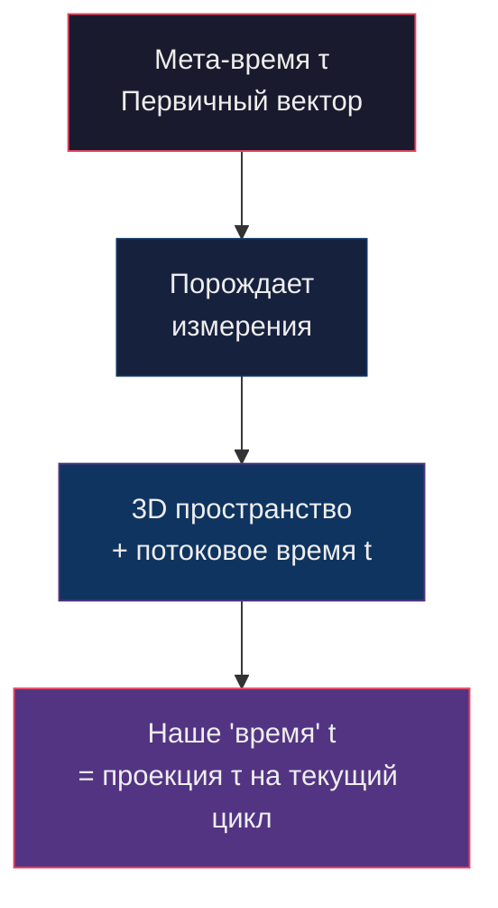

# Гравитация Нулевого Вектора (NVG)
## *Теоретический каркас для циклической космологии*

---

## 1. Философская основа

> **Аксиома Нуля**: Единственное истинно стабильное состояние — это **Ничто** (Ω₀). 
> Всё, что существует — это отклонение от Ничто. Гравитация — это стремление вернуться.

Вселенная не «появилась из ничего» — она **является** возмущением Ничего. 
Каждая частица, каждое поле, каждое измерение — это натяжение на ткани Ω₀, 
и всё натяжение стремится к разрядке.

---

## 2. Формальные определения

### 2.1. Пространство состояний

| Символ | Определение |
|--------|-------------|
| **Ω₀** | Абсолютное Ничто — нулевая точка без измерений, энергии, информации |
| **τ** | Мета-время — первичный вектор смещения Ω₀ |
| **δ(x, τ)** | Функция отклонения точки x от состояния Ω₀ в мета-эпохе τ |
| **𝒲** | Паутина (Web) — топологическая структура всех связей между отклонениями |
| **n** | Номер цикла вселенной (текущая вселенная = цикл N) |
| **ℓₙ** | Масштаб Планка цикла n — содержит свёрнутую вселенную цикла (n-1) |

### 2.2. Операторы

| Оператор | Действие |
|----------|----------|
| **T̂** (генезис) | Смещает Ω₀ вдоль τ, порождая первое измерение |
| **Ĉ** (компрессия) | Сжимает вселенную цикла n в зерно цикла n+1 |
| **R̂** (возврат) | Восстанавливающая сила — стремление к Ω₀ |

---

## 3. Аксиоматика NVG

### Аксиома I — Генезис измерений

Бесконечное число измерений коллапсирует в скалярный ноль:

```
lim(d→∞) V(d) = Ω₀ = 0
```

где V(d) — объём d-мерного пространства при стремлении метрики к нулю.

> [!NOTE]
> **Связь с физикой**: В теории струн существует 10-11 измерений, компактифицированных 
> до планковских масштабов (многообразия Калаби-Яу). NVG обобщает: *все* бесконечные 
> измерения схлопнулись, а не только «лишние».

### Аксиома II — Первичный вектор

Мета-время τ смещает Ω₀, создавая первое измерение:

```
T̂|Ω₀⟩ = ε·|1⟩     где ε → 0⁺
```

Первое измерение — это **линия отклонения** от Ничто. Не пространство, не время — 
а **направление нестабильности**.

> [!NOTE]
> **Связь с физикой**: Аналог квантовой флуктуации вакуума. В модели Хартла-Хокинга 
> (no-boundary proposal) вселенная тоже начинается из точки без граничных условий.

### Аксиома III — Стремление к возврату

Каждое отклонение δ порождает восстанавливающую силу, направленную к Ω₀:

```
F_return = -∇Φ(δ)     где Φ(δ) = κ · |δ|²/2 + λ · |δ|⁴/4
```

- Квадратичный член (κ|δ|²) — линейное притяжение к Ничто (→ ньютонова гравитация)
- Квартичный член (λ|δ|⁴) — нелинейное усиление при больших отклонениях (→ ОТО)

### Аксиома IV — Паутина

Отклонения не изолированы — они связаны топологической паутиной 𝒲:

```
𝒲 = {(δᵢ, δⱼ) : Γᵢⱼ ≠ 0}     — граф связей

Γᵢⱼ = exp(-|xᵢ - xⱼ|² / 2σ²) · f(δᵢ, δⱼ)
```

Каждый узел паутины «чувствует» соседей. Комки паутины = массивные объекты.

### Аксиома V — Фрактальная вложенность

Каждый планковский объём текущего цикла содержит полную информацию предыдущего цикла:

```
ℓₙ = Ĉ[Uₙ₋₁]     — вселенная (n-1) сжата в зерно размера ℓₚ цикла n

I(ℓₙ) = S_BH(Uₙ₋₁) = A(Uₙ₋₁) / 4ℓₚ²
```

где S_BH — энтропия Бекенштейна-Хокинга, A — площадь горизонта предыдущей вселенной.

> [!IMPORTANT]
> Это означает: внутри каждого кванта пространства — **бесконечная** рекурсия вселенных.
> Мы буквально состоим из сжатых мёртвых вселенных.

---

## 4. Центральная формула гравитации NVG

### 4.1. Полная формула

```
                         Mᵢ · Mⱼ              δᵢ · δⱼ
G_NVG(i,j) = G_eff(n) · ——————— · Γᵢⱼ(𝒲) · ————————— · Ψ(τ)
                          rᵢⱼ²               |Ω₀|² + ε
```

где:

| Компонент | Значение | Физический смысл |
|-----------|----------|------------------|
| `G_eff(n)` | `G₀ · (ℓₙ/ℓₙ₋₁)²` | Эффективная гравитационная постоянная, зависящая от номера цикла |
| `Mᵢ · Mⱼ / rᵢⱼ²` | Классический член | Закон Ньютона — предел NVG при слабых полях |
| `Γᵢⱼ(𝒲)` | Связность паутины | Топологический множитель: насколько i и j связаны в 𝒲 |
| `δᵢ · δⱼ / (\|Ω₀\|² + ε)` | Отклонение от Ничто | Чем сильнее оба объекта отклонены от Ω₀, тем сильнее притяжение |
| `Ψ(τ)` | Фазовая функция цикла | Модулирует силу гравитации в зависимости от стадии цикла |

### 4.2. Фазовая функция цикла

```
Ψ(τ) = sin²(π · τ/T_cycle)
```

- **τ = 0** (Большой взрыв): Ψ → 0, гравитация минимальна, расширение доминирует
- **τ = T/2** (пик): Ψ = 1, максимальная гравитация
- **τ → T** (Большое сжатие): Ψ → 0, но скорость коллапса уже критическая

```
     Ψ(τ)
  1 ─┤        ╭──────╮
     │       ╱        ╲
     │      ╱          ╲
     │     ╱            ╲
  0 ─┤────╱              ╲────
     └────┼───────┼───────┼────→ τ
          0      T/2      T
        Взрыв    Пик    Сжатие
```

### 4.3. Тензорная форма (для ОТО-совместимости)

Модифицированные уравнения Эйнштейна:

```
Gμν + Λ(τ)·gμν = (8πG_eff(n)/c⁴) · [Tμν + Wμν(𝒲)]
```

- **Gμν** — тензор Эйнштейна (кривизна)
- **Λ(τ)** — космологическая «постоянная», зависящая от фазы цикла
- **Wμν(𝒲)** — тензор паутины (дополнительный источник кривизны от топологии 𝒲)

```
Λ(τ) = Λ₀ · cos(2π · τ/T_cycle)
```

- В начале цикла: Λ > 0 → расширение (тёмная энергия!)
- В конце цикла: Λ < 0 → сжатие

> [!TIP]
> Это элегантно объясняет, почему тёмная энергия существует: мы находимся 
> в фазе Ψ < 1, где Λ(τ) > 0. Вселенная ещё не достигла точки перелома.

---

## 5. Время в NVG

### 5.1. Два вида времени



| Мета-время τ | Потоковое время t |
|---------------|-------------------|
| Абсолютный вектор | Локальное проявление |
| Линеен, необратим | Может замедляться (ОТО) |
| Существует между циклами | Существует только внутри цикла |
| Создаёт измерения | Является одним из измерений |

### 5.2. Формула связи

```
t = ∫₀ᵗ √(g₀₀) dτ' · h(n)

h(n) = (ℓₙ/ℓ₀)^α     — масштабный фактор цикла, α ≈ 2
```

Наше время t — это **интеграл мета-времени**, взвешенный метрикой пространства. 
Потоковое время — тень первичного вектора.

---

## 6. Цикл вселенной

```
   Ω₀ ──τ──→ |1⟩ ──→ |3+1⟩ ──→ Расширение ──→ Пик ──→ Сжатие ──→ Ω₀'
    ↑                                                                  │
    │                         Ĉ: компрессия                           │
    └──────────────────────────────────────────────────────────────────┘
                        Ω₀' содержит всю информацию
                        и становится ℓₙ₊₁ нового цикла
```

### Уравнение цикла:

```
Uₙ₊₁ = T̂[Ĉ[Uₙ]]

Энтропия: S(Uₙ₊₁) ≥ S(Uₙ)     — второй закон сохраняется между циклами
```

> [!IMPORTANT]
> Информация не теряется — она **сжимается**. Каждый новый цикл начинается 
> с большей начальной сложностью. Это объясняет тонкую настройку констант: 
> они — результат бесконечной оптимизации через рекурсию.

---

## 7. Соответствие современной физике

### 7.1. Прямые параллели

| Концепция NVG | Современная теория | Статус |
|---------------|-------------------|--------|
| Бесконечные измерения → Ω₀ | Компактификация в теории струн | Подтверждена математически |
| Циклы вселенной | Конформная циклическая космология Пенроуза (CCC) | Есть косвенные данные (кольца Хокинга в CMB) |
| Фрактальная вложенность | Голографический принцип ('т Хоофт, Сасскинд) | Подтверждён для чёрных дыр |
| Паутина 𝒲 | Космическая паутина (Large Scale Structure) | Наблюдается напрямую |
| Λ(τ) переменная | Квинтэссенция / динамическая тёмная энергия | Данные DESI (2024) допускают w ≠ -1 |
| Мета-время τ | Проблема времени в квантовой гравитации | Открытый вопрос |
| Стремление к Ω₀ | Тепловая смерть / Big Crunch | Зависит от Λ |
| G_eff(n) | Вариация G в теориях Бранса-Дикке | Ограничена, но не исключена |

### 7.2. Данные DESI 2024-2025

Результаты DESI (Dark Energy Spectroscopic Instrument) показали, что параметр 
уравнения состояния тёмной энергии **w может меняться со временем** (w₀ ≈ -0.55, wₐ ≈ -1.6), 
что противоречит модели ΛCDM с постоянным Λ.

**В NVG это естественно**: Λ(τ) = Λ₀·cos(2πτ/T) — космологическая постоянная 
*обязана* меняться, так как вселенная движется по фазовому циклу.

### 7.3. Кольца Хокинга в CMB

Пенроуз и Гурзадян обнаружили концентрические кольца аномально низкой дисперсии 
в реликтовом излучении — возможные «следы» предыдущего цикла.

**В NVG**: это отпечатки комков паутины 𝒲 предыдущего цикла, 
сохранившиеся при операции компрессии Ĉ.

---

## 8. Предсказания NVG

> [!WARNING]
> Эти предсказания делают теорию фальсифицируемой — ключевое требование научности.

1. **G меняется**: Гравитационная постоянная должна иметь дрейф ~10⁻¹³/год 
   (текущий предел измерений: < 10⁻¹²/год — на грани обнаружения)

2. **Λ не постоянна**: Тёмная энергия ослабнет и сменит знак. 
   Временная шкала: ~10¹⁰ лет (DESI уже видит намёки)

3. **Фрактальная структура на планковском масштабе**: 
   Если удастся зондировать масштабы ~ℓₚ, должна обнаружиться 
   самоподобная структура (следы предыдущих циклов)

4. **Корреляции в CMB**: Больше колец Пенроуза с определённым спектром, 
   задаваемым функцией Γᵢⱼ паутины

5. **Аномалия на горизонте**: При τ → T (конец цикла), 
   квантовая запутанность должна усиливаться нелинейно — 
   проверяемо в лабораторных экспериментах с EPR-парами

---

## 9. Сводная формула для книги

Для художественного текста — компактная запись:

```
╔══════════════════════════════════════════════════════════════╗
║                                                              ║
║                    δᵢ · δⱼ                                   ║
║   F = -G(n) · ————————————— · Γ(𝒲) · Ψ(τ)                  ║
║                   r²                                         ║
║                                                              ║
║   «Всё, что отклонилось от Ничто —                          ║
║    стремится вернуться, увлекая соседей»                     ║
║                                                              ║
╚══════════════════════════════════════════════════════════════╝
```

**Словами**: Сила притяжения между двумя объектами пропорциональна 
произведению их отклонений от абсолютного Ничто, обратно пропорциональна 
квадрату расстояния, усилена связностью паутины и модулирована 
фазой космического цикла.

---

## 10. Глоссарий для книги

- **Ω₀ (Омега-ноль)** — Абсолютное Ничто. Не пустота, не вакуум — отсутствие самого понятия существования.
- **τ (тау)** — Мета-время. Первичная стрела, породившая первое измерение.
- **δ (дельта)** — Отклонение. Мера «существования» объекта.
- **𝒲 (Паутина)** — Невидимая сеть связей между всем, что существует.
- **Цикл n** — Номер текущей итерации вселенной. Мы — цикл N (неизвестно какой).
- **ℓₙ (Зерно)** — Планковский объём, содержащий сжатую предыдущую вселенную.
- **Ĉ (Компрессия)** — Процесс сжатия умирающей вселенной в зерно новой.
- **Ψ (Пси)** — Фаза цикла. Определяет, расширяемся мы или сжимаемся.

---

*«Мы — рябь на поверхности Ничто, и гравитация — это наша тоска по покою»*
